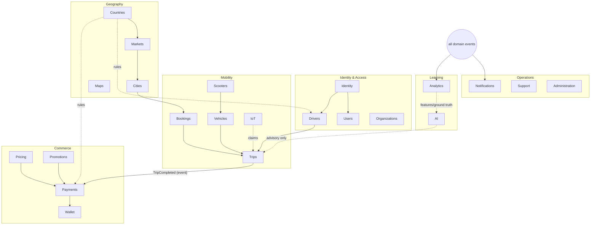
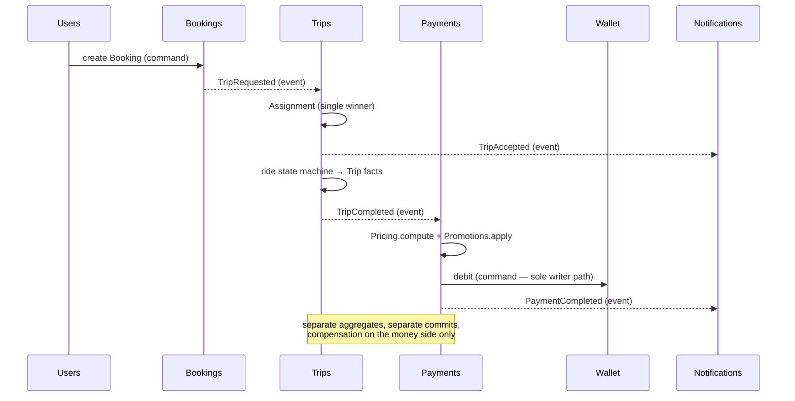
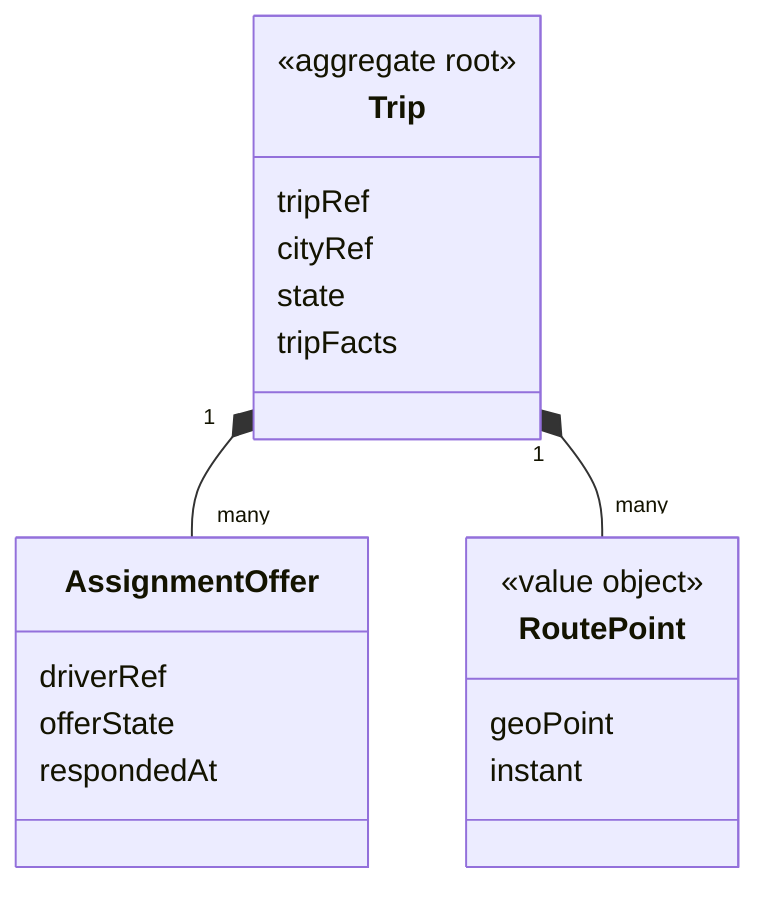

# ADR-002 — Domain Model

**Status:** Proposed · **Owner:** Chief Enterprise Architecture · **Date:** 2026-07-18
**Scope:** the canonical business domain model of the OnCall Global Mobility Platform.
Implementation-independent by rule: no technologies, protocols, storage engines, or
frameworks appear in this document.

> **Relationship to the prior corpus.** The macro-level domain model previously certified
> in `docs/ADR-002-global-domain-model.md` (six macro-domains + amendments) remains valid.
> This document is its **canonical operational decomposition**: the 22 bounded contexts
> below nest within those macro-domains (mapping in §4.0). Where granularities differ,
> this document governs day-to-day design; the macro model governs philosophy.

---

## 1. Context

OnCall operates a production mobility platform (taxi + scooter, single market today) and
is evolving into a global multi-vertical platform. The implicit domain concepts in the
running system are healthy but under-named. This ADR fixes the ubiquitous language,
bounded contexts, aggregates, and communication rules that every future feature must
reference.

## 2. Domain-Driven Design Principles Applied

- **Ubiquitous language.** Every term in this document means exactly one thing platform-
  wide. A "Trip" is the measured journey; a "Booking" is the request; a "Ride" (used
  informally) is the fulfillment episode connecting them — the words are not
  interchangeable, in conversation or in code.
- **Bounded contexts.** The domain is partitioned into contexts, each with its own model
  and vocabulary, valid only inside its boundary. The same real-world thing may appear
  differently in two contexts (a Driver is a credentialed role in Identity, a supply
  unit in Trips, a payee in Payments) — this is intentional, not duplication.
- **Aggregates and invariants.** Each context defines aggregate roots — consistency
  boundaries within which invariants hold transactionally. Nothing outside an aggregate
  may hold a reference into its interior; only the root is addressable.
- **Domain events.** Contexts announce completed facts as past-tense events; events are
  the primary integration mechanism between contexts.
- **Anti-corruption.** Foreign vocabularies (external providers, and the platform's own
  legacy surface) are translated at boundaries and never leak inward.
- **Context mapping over shared models.** No shared "common model" exists across
  contexts; sharing happens by published contract and identifier reference only.

## 3. Global Modeling Rules

1. Every cross-context reference is an **opaque global identifier + kind**; never a copy.
2. High-volume operational entities (Bookings, Trips, Payments) carry only a **City
   reference**; Market/Country context derives through the geographic chain.
3. Monetary state changes only by **appended ledger entries** with a named cause.
4. Facts are immutable; corrections are new facts.
5. A command mutates exactly **one aggregate in one context**; anything wider is a
   process coordinated by events with declared compensation.

## 4. Bounded Contexts

### 4.0 Macro-domain mapping

| Macro-domain (prior ADR-002) | Contexts in this decomposition |
|---|---|
| Geography & Localization | Countries, Cities, Markets, Maps |
| Identity & Access | Identity, Users, Drivers, Organizations |
| Mobility | Vehicles, Scooters, Bookings, Trips, IoT |
| Commerce | Payments, Wallet, Pricing, Promotions |
| Operations | Notifications, Support, Administration |
| Analytics | Analytics, AI |

### 4.1 Context catalog

Legend: **Owns** = authoritative data · **Public** = published capabilities/queries/events
· **Deps** = allowed dependencies · **Forbidden** = dependencies that are architectural
violations.

| Context | Purpose & Responsibilities | Owns | Public interfaces | Deps | Forbidden |
|---|---|---|---|---|---|
| **Identity** | authentication, sessions, credentials, role & permission model; the platform's "who is asking and may they" | credentials, sessions, roles, permissions, verification outcomes | authenticate; authorize(actor, action, scope); session lifecycle; `IdentityVerified`, `SessionRevoked` | Countries (verification rules by jurisdiction), Notifications (delivery only) | any business context's data; Payments; Analytics |
| **Users** | the person as platform subject: profile, preferences, standing | user profiles, preferences, consents, standing | user query by reference; `UserRegistered`, `UserSuspended` | Identity (authn facts) | Drivers' internals; Wallet balances (references only) |
| **Drivers** | the driver *role*: licensing, qualifications, approval lifecycle, performance record | driver records, approval state & history, qualifications, ratings | driver standing query; approval workflow; `DriverApproved`, `DriverSuspended`, `DriverOnline/Offline` | Identity (the underlying User), Countries (license rules), Vehicles (qualification link) | Payments internals; direct Wallet mutation; Trips internals |
| **Organizations** | tenancy anchor: companies, fleets-owners, B2B customers, membership & org-roles | org records, memberships, org agreements | org query; membership check; `OrganizationCreated`, `MemberAdded` | Identity, Users | operational contexts' data; Payments internals |
| **Vehicles** | physical assets: registration, state, fleet membership, maintenance & inspection history | vehicle registry, states, fleet assignments, maintenance/inspection records | vehicle eligibility query; `VehicleRegistered`, `VehicleRetired`, `InspectionPassed/Failed` | Organizations (owning fleet), Countries (regulations), IoT (telemetry claims) | Trips internals; Pricing |
| **Scooters** | scooter-vertical specifics: rental lifecycle, battery/parking rules, zone constraints (a specialization consuming Vehicles) | rental sessions, scooter operational states | unlock/rent/return capabilities; `ScooterUnlocked`, `RideEnded(scooter)` | Vehicles, Cities (zones), Identity, Pricing (estimate), Wallet (via Payments) | direct ledger writes; Maps internals |
| **Bookings** | customer *intent*: what, where, when; offer/acceptance state before fulfillment | booking requests, offer states, expiry policy | create/cancel booking; booking status; `TripRequested`, `BookingExpired`, `BookingCancelled` | Users, Cities, Pricing (estimates), Maps (place resolution) | Trips internals; Payments; driver selection logic (that is Trips/dispatch) |
| **Trips** | fulfillment & journey: dispatch/assignment, ride state machine, the measured Trip record | assignments & offers, ride states, trip facts (route, distance, duration) | trip status; assignment offers; `TripAccepted`, `TripStarted`, `TripCompleted`, `TripCancelled` | Bookings, Drivers (standing), Vehicles, Cities, Maps (routes advisory), IoT (position claims) | Wallet/ledger mutation; Pricing rule authoring; Users profile data |
| **Payments** | settling obligations: payment attempts, instruments, external processor lifecycle, refunds | payment attempts & outcomes, instrument references, refund records | initiate/settle/refund; payment status; `PaymentCompleted`, `PaymentFailed`, `RefundIssued` | Trips (billable cause), Pricing (amount due), Wallet (instrument), Promotions (discounts applied) | Trips state mutation; Pricing authoring |
| **Wallet** | stored value: balances as ledger derivations, top-ups, holds, statements | ledger entries, wallet records, holds | balance & statement queries; credit/debit via Payments; `WalletCredited`, `WalletDebited` | Payments (the only writer of movements), Users/Organizations (owners) | any other context writing movements; Analytics as truth source |
| **Notifications** | platform → person communication: templates, localization, delivery, records | templates, delivery records, device registrations | send-on-event subscriptions; delivery status; `NotificationDelivered/Failed` | all contexts' events (consumer), Countries (locale/templates), Identity (devices) | inventing content (templates only); blocking any producer |
| **Support** | customer care: tickets, conversations, resolutions, SLAs | tickets, threads, resolutions, SLA clocks | open/track/resolve ticket; `TicketOpened`, `TicketResolved` | references to Trips/Payments/Users (read via contracts) | mutating any referenced context's state directly |
| **Pricing** | fare rules as authored data: base/distance/time/surge rules per city & vehicle type; estimation & final fare computation | pricing rule versions, fare computations (as facts) | estimate(booking); compute(trip); `PricingRulesPublished` | Cities/Markets (scope), Countries (tax profile linkage) | Payments execution; Promotions internals (composes via contract) |
| **Promotions** | incentives: codes, campaigns, eligibility, budgets, redemptions | campaigns, eligibility rules, redemption records | validate/apply promotion; `PromotionRedeemed`, `CampaignExhausted` | Users (eligibility), Pricing (discount application point), Markets (scope) | direct ledger writes; Identity internals |
| **Maps** | geospatial capability: place resolution, geocoding claims, route/ETA advisory (external providers behind translation) | place mappings, provider reference claims, cached resolutions | resolve place; route/ETA advisory | external providers (behind anti-corruption), Cities (zone geometry consumer) | being authoritative for any Trip fact; storing provider vocabulary raw |
| **Countries** | jurisdiction & national reference: regulatory rule sets, languages, currencies, tax profiles, national formats | country records, rule families, locale/currency/format reference | rule resolution (actor, action, place); reference queries; `CountryActivated` | — (reference root) | any operational context's data |
| **Cities** | the operational atom: city records, zones & their rules, city service catalog, city configuration | city records, zones, city-level config | city/zone resolution; zone rule query; `CityLaunched`, `ZoneRuleChanged` | Countries (parent), Markets (operational parent) | operational contexts' data |
| **Markets** | operational business unit between Country and City: market configuration, pricing defaults, manager scopes, KPIs | market records, market config versions, goals/KPI definitions | market config resolution; `MarketActivated` | Countries, Cities (children) | high-volume operational data (derives via City) |
| **AI** | decision support & optimization under registered decision classes: predictions, recommendations, assisted decisions with fallbacks | model registry (versions, classes, envelopes), prediction/recommendation records | advisory interfaces per registered capability; `ModelPromoted/Demoted` | Analytics (features/ground truth), any context *as consumer of its advice* | owning any business decision outright; writing to any other context; governance functions |
| **IoT** | device-world boundary: vehicle/scooter telemetry intake, command dispatch to hardware, device health (behind anti-corruption) | device registry, telemetry streams (as claims), command logs | telemetry subscription; device command capability; `DeviceOffline`, `TelemetryAnomaly` | Vehicles/Scooters (subjects) | asserting business facts (telemetry is claim, not fact, until a context adopts it) |
| **Analytics** | learning from facts: aggregates, KPIs, reports — never authoritative, never blocking | derived datasets, report definitions, metric series | certified query/report interfaces | all contexts' events (consumer only) | being a dependency of any command path; writing to any context |
| **Administration** | governed authoring & operator surfaces: configuration publishing, reference-data authoring, operational actions — every write audited | authoring workflow state, publication records | staged publish workflows; operator action capabilities; `ConfigPublished` | the contexts whose data it authors *through their own contracts*, Identity (operator authz) | bypassing target-context invariants; unaudited writes |

## 5. Aggregate Roots

One consistency boundary each; all interior access via the root:

| Context | Aggregate root(s) | Key invariant protected |
|---|---|---|
| Identity | `IdentityAccount`, `Session` | one live credential set per account; revocation is total |
| Users | `User` | one person, one User; standing changes are auditable facts |
| Drivers | `DriverProfile` | approval state machine legality (pending→approved→suspended→…) |
| Organizations | `Organization` | membership & role consistency within the org |
| Vehicles | `Vehicle`, `Fleet` | a vehicle has one operational state and one fleet membership |
| Scooters | `RentalSession` | one active rental per scooter; return closes exactly one session |
| Bookings | `Booking` | single offer-state; expiry and cancellation are terminal |
| Trips | `Trip` (incl. Assignment) | **single-winner assignment**; ride state machine legality; trip facts immutable at completion |
| Payments | `Payment` | one outcome per attempt; refunds reference their payment |
| Wallet | `WalletAccount` (ledger) | balance ≡ fold of entries; no entry without cause |
| Notifications | `NotificationDispatch` | at-least-once with recorded outcome per target |
| Support | `Ticket` | thread integrity; resolution requires evidence |
| Pricing | `PricingRuleSet` (versioned) | rules effective-dated; computation cites its version |
| Promotions | `Campaign` | budget never over-redeemed; redemption idempotent |
| Maps | `PlaceMapping` | one platform place per external claim set |
| Countries | `Country` | rule families versioned, never edited |
| Cities | `City` (incl. Zones) | zone geometries and rules consistent within the city |
| Markets | `Market` | config versions effective-dated |
| AI | `RegisteredCapability` | class/envelope changes are governed events |
| IoT | `Device` | one identity per physical device; claims attributed |
| Analytics | `CertifiedDataset` | provenance complete or not queryable |
| Administration | `PublicationWorkflow` | author ≠ approver; staged states legal |

## 6. Entities (non-root, within aggregates)

Examples of interior entities (addressable only through their roots): `Credential` and
`DeviceBinding` (in IdentityAccount); `ApprovalRecord` (in DriverProfile);
`Membership` (in Organization); `InspectionRecord`, `MaintenanceOrder` (in Vehicle);
`AssignmentOffer` (in Trip); `RefundRecord` (in Payment); `LedgerEntry` (in
WalletAccount — append-only); `Message` (in Ticket); `PricingRule` (in PricingRuleSet);
`Redemption` (in Campaign); `Zone` (in City); `TelemetryChannel` (in Device).

## 7. Value Objects

Immutable, identity-free, compared by value, shared vocabulary across contexts:
`Money` (amount + currency, minor-unit aware) · `GeoPoint` and `GeoPath` ·
`PhoneNumber` (national-format aware) · `Locale` · `TimeWindow` · `Address`
(country-format aware) · `Rating` · `Distance` / `Duration` · `PlateNumber` ·
`FareBreakdown` (base, distance, time, surge, tax, discount components) ·
`ConfidenceScore` (calibrated, with class floor) · `RuleVersionRef` (family + version +
effective instant) · `EntityRef` (global id + kind — the only legal cross-context
pointer).

## 8. Domain Events (canonical set)

Past-tense, emitted once by the owning context at commit, carrying `EntityRef`s:

`UserRegistered` · `IdentityVerified` · `SessionRevoked` · `DriverApproved` ·
`DriverSuspended` · `DriverOnline` / `DriverOffline` · `OrganizationCreated` ·
`VehicleRegistered` · `InspectionFailed` · `ScooterUnlocked` · `TripRequested` ·
`TripAccepted` · `TripStarted` · `TripCompleted` · `TripCancelled` ·
`PaymentCompleted` · `PaymentFailed` · `RefundIssued` · `WalletCredited` ·
`WalletDebited` · `PromotionRedeemed` · `PricingRulesPublished` · `TicketOpened` ·
`TicketResolved` · `CityLaunched` · `MarketActivated` · `CountryActivated` ·
`ConfigPublished` · `ModelPromoted` / `ModelDemoted` · `DeviceOffline` ·
`NotificationDelivered`.

Event rules: meaning is immutable once published; evolution is additive; consumers are
idempotent and replay-tolerant; ordering is guaranteed per subject only.

## 9. Ownership Boundaries

Each context is the **single writer** of the data it owns (§4.1 "Owns" column). Reading
another context's data happens only through its public interfaces or by consuming its
events into a private read model. Three platform-wide sharpening rules: only **Payments**
commands Wallet movements; only **Trips** produces trip facts (IoT telemetry becomes fact
only when Trips adopts it); only **Administration** publishes configuration — through the
owning context's own staged-publish contract, never around it.

## 10. Communication Rules Between Domains

1. **Events first.** The default cross-context mechanism is consuming the owner's events.
2. **Commands to the owner** only when the caller's use case cannot proceed without the
   owner's decision now (authorization, atomic assignment, payment initiation).
3. **Queries never mutate** and declare their freshness.
4. **No shared state, no reach-ins, no side channels** — collaboration outside contracts
   is an architectural violation regardless of convenience.
5. **Translation at every foreign boundary** (Maps providers, IoT hardware, external
   processors — and the platform's own legacy surface).
6. **Failure isolation:** a consumer's failure never blocks a producer; Analytics and AI
   may be entirely absent while the operational platform runs.

## 11. Why Each Boundary Exists

Identity is separate from Users so *proving who you are* never entangles with *what you
are like* (security posture vs. profile churn). Drivers is separate from Users because a
role with a regulated lifecycle must not complicate every ordinary customer. Bookings is
separate from Trips because intent and fulfillment fail differently (an unmatched booking
is normal; a broken trip is an incident) — fusing them created the platform's oldest
defect class. Trips is separate from Payments so journey truth and money truth can never
corrupt each other. Wallet is separate from Payments so stored value has exactly one
ledger and many settlement paths. Pricing and Promotions are separate authored-data
contexts so commercial tuning never touches settlement code. Scooters is separate from
Vehicles because rental UX rules churn fast while asset truth changes slowly. Maps and
IoT are boundaries because external vocabularies must die at the door. Countries / Cities
/ Markets are three contexts because law, operations, and management change at different
speeds with different owners. AI and Analytics are quarantined from command paths by
design — advice and learning must never become load-bearing by accident. Administration
exists so governed authoring has one audited front door.

## 12. Diagrams

### 12.1 Context map (macro view)

### 12.2 Demand-to-money flow (event backbone)

### 12.3 Trip aggregate (consistency boundary)

## 13. Future Scalability Considerations

The model scales without redesign because: contexts partition along their own keys
(City for operational, User/Organization for personal/tenant data); every unbounded-
growth aggregate (Trips, Payments, LedgerEntries) is append-only and time/City-
partitionable; reference contexts (Countries, Cities, Markets, Pricing) are immutable-
versioned and cacheable everywhere; new verticals enter as new Vehicle Types + rental/
dispatch specializations without new contexts; new countries enter as Countries/Markets/
Cities rows; the AI and Analytics quarantine means intelligence can scale (or fail)
independently of operations. If load ever justifies physical decomposition, these
context boundaries are the seams — decomposition becomes a deployment decision, not a
modeling project.

## 14. Decision

Adopt this model as the canonical domain model. Every major feature must name the
contexts and aggregates it touches; every new concept must find its home in exactly one
context or trigger an amendment to this ADR.

---

*ADR-002 — Domain Model. Governed by the architecture contribution process
(`architecture/README.md`); amendments follow the standing amendment pattern.*
