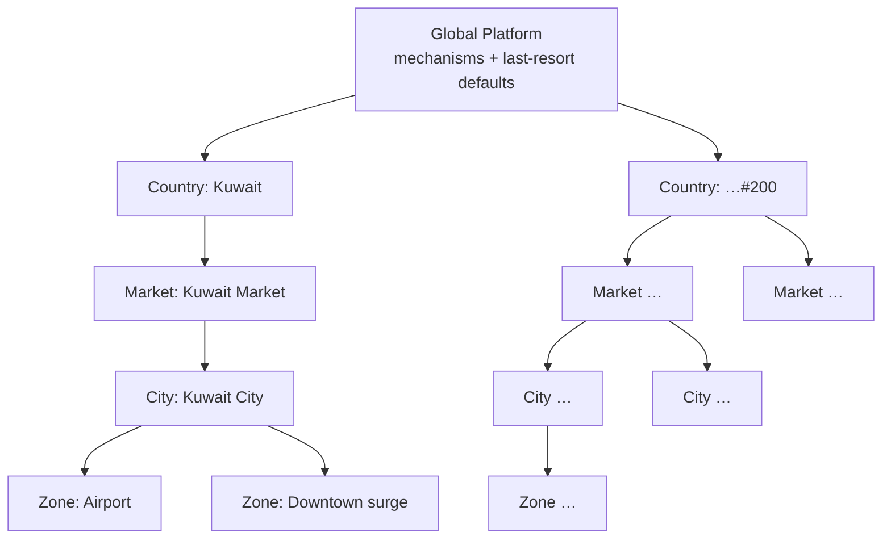
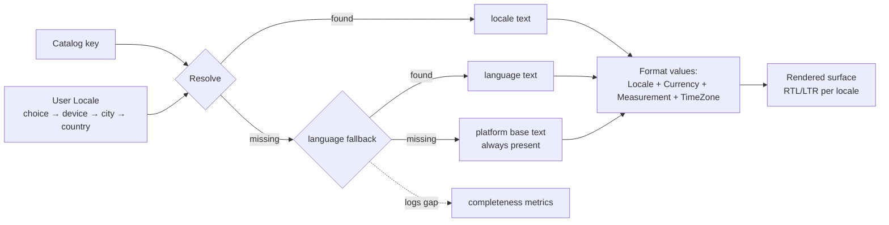
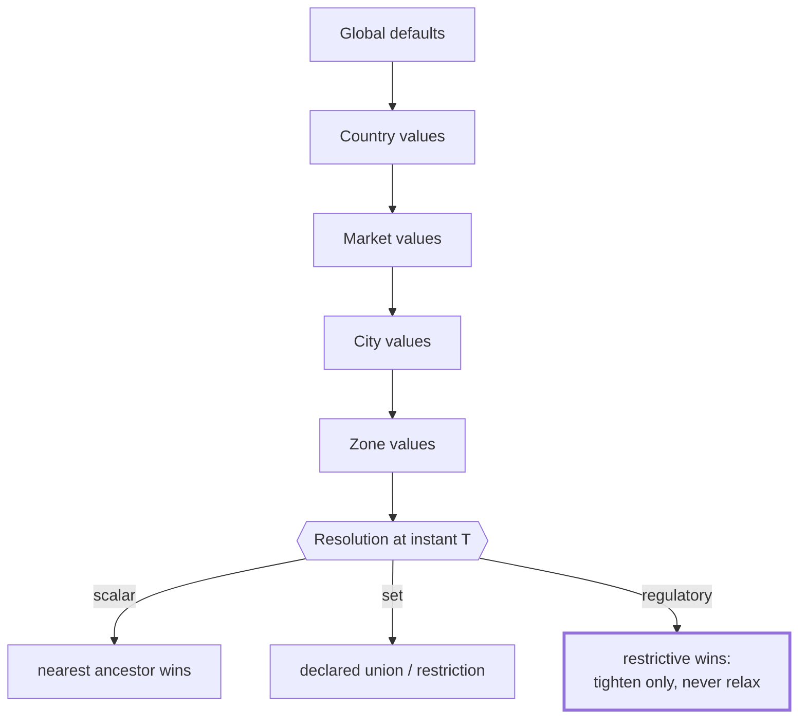

# ADR-003 — Globalization & Localization Domain Model

**Status:** FINAL · **Owner:** Chief Enterprise Architecture · **Date:** 2026-07-18
**Depends on:** ADR-002 (Domain Model — Countries, Markets, Cities, Maps contexts)
**Scope:** how the platform supports every country in the world without architectural
change. Implementation-independent by rule.

> **Relationship to the prior corpus.** This document supersedes-in-place the
> country/localization material of `docs/ADR-003-*` for day-to-day design. The optional
> administrative *Region* tier described there remains available as a passthrough level
> between Market and City where national administration requires it; it carries no
> configuration and is omitted from the operational chain below.

---

## 1. Globalization Philosophy

**Entering a country is an act of authorship, not engineering.** Everything that differs
between countries — language, money, law, formats, prices, rules — is expressed as
authored, versioned reference data resolved through one inheritance chain. The platform
ships one set of mechanisms worldwide; countries differ only in the data those mechanisms
consume. The test every design must pass: *could country #200 launch with zero code
change?* If not, the design is wrong — not the country.

Three corollaries: the home market is entry #1 of every mechanism, never a special case
baked into code; law always outranks configuration; and anything a launch team cannot do
without engineers is an architecture gap to be fixed once, for all countries.

## 2. The Hierarchy

```
Global Platform      — mechanisms, defaults of last resort
    ↓
Country              — legal & national boundary (jurisdiction, currency, languages)
    ↓
Market               — operational business unit (management, P&L, config defaults)
    ↓
City                 — the operational atom (supply, demand, launch, zones)
    ↓
Zone                 — sub-city geometry with rule payloads (surge, no-ride, airports)
```

Every level except Global is a record in the Geography contexts (ADR-002 §4.1:
Countries, Markets, Cities). A City belongs to exactly one Market; a Market to exactly
one Country. Zones belong to exactly one City and are the only tier carrying geometry.

## 3. Ownership

| Tier | Owned by (context) | Governed by |
|---|---|---|
| **Countries** | Countries context — records, rule families, national reference data | platform governance + legal sign-off per rule family |
| **Markets** | Markets context — market records, config versions, KPIs | Market management (scoped roles) within platform invariants |
| **Cities** | Cities context — city records, service catalog, city config | Market management (parent), launch gated |
| **Zones** | Cities context (interior to the City aggregate) | city operations; regulatory zones require compliance sign-off |

Ownership rule: geography tiers are **reference data with single writers**; operational
contexts hold references to them and never copies.

## 4. National Reference Dimensions

All owned by the Countries context (locale/format material shared with Cities where
city-specific), all versioned per §12–13:

- **Languages** — languages the platform speaks (direction, plural categories). Adding
  one is authoring catalogs, never code.
- **Locales** — language × territory: the *formatting authority* (dates, numbers,
  collation, direction). Formatting always comes from Locale, never from Language alone.
- **Time Zones** — assigned **per City** (countries span zones). Instants are stored
  absolutely; rendering and "today" are always city-local.
- **Currencies** — code, minor units (3-decimal currencies are data, not assumption),
  rounding, cash denominations. One operational currency per country.
- **Tax Profiles** — the country's tax regime: named rules (kind, base, rate,
  applicability), effective-dated; consumed at settlement, never hardcoded.
- **Measurement Systems** — display regime per country; canonical storage is metric
  forever; conversion happens at presentation only.
- **Phone Formats** — national numbering plans: lengths, mobile patterns, display
  format; storage canon is the international form.
- **Address Formats** — field sets, order, and mandatoriness per country; no universal
  address schema is attempted — the format *is* the data.
- **Government Regulations** — regulatory rule families (identity verification, driver
  licensing, vehicle requirements, insurance, privacy, payment restrictions), authored
  per country, effective-dated, evaluated as gates by the owning contexts.
- **Business Rules** — non-legal commercial policy (cancellation windows, commission
  bands, support SLAs). Distinct from regulation on purpose: business rules may relax
  down the chain; regulations may only tighten.

## 5. How Localization Works

Every user-visible string is a **catalog key**, never a literal. At render time the
platform resolves *(key, user's Locale)* through the fallback chain
`locale → language → platform base language`, guaranteeing an answer at the base — a
missing translation logs a completeness gap and degrades gracefully, never blocks a
flow. Templates (notifications, documents) consume catalog keys plus locale-formatted
values. Localization ships as versioned **packages** per country (catalogs + locales +
templates), releasable independently of any software release. Right-to-left rendering is
a first-class mode: the platform's home language is RTL, so RTL correctness is the
default bar, not an afterthought.

## 6. How Multiple Languages Work

A country declares its supported languages; a user carries a Locale preference (explicit
choice → device signal → city default → country default). All parties in one interaction
may use different languages simultaneously — driver and rider each see their own Locale;
records store keys and canonical values so any past interaction re-renders in any
language. Plural rules are per-language category sets (the home language's six
categories are the proof case); grammar is never assembled by concatenation. Launch
gating: a language becomes user-selectable only when its catalogs pass completeness
thresholds (100% for legal-critical namespaces).

## 7. Currency Conversion Philosophy

**Operational money never converts.** A trip priced, paid, and settled in a country
happens entirely in that country's currency; wallets are single-currency per country.
Conversion exists only in two governed places: **reporting** (consolidation to a
reporting currency using dated exchange-rate facts, append-only, source-attributed) and
**future cross-border instruments** (a card issued abroad settles via the payment
processor's conversion — the platform records the national-currency obligation and the
processor's conversion as an external claim). The platform never invents an exchange
rate and never stores a converted number without its rate fact.

## 8. Pricing Localization

Pricing rules (ADR-002 Pricing context) are authored **per City** with **Market
defaults** and **Country floors/ceilings** where regulation requires: base fare,
distance/time components, surge policy, minimums — all in national currency with
national rounding, versioned and effective-dated. Zone payloads modulate within city
rules (airport surcharges, event surge caps). A fare computation permanently cites the
rule version it used, so any historical fare is reproducible and defensible. Display
formatting (symbols, separators, decimal places) comes from Locale + Currency — the same
fare renders correctly for every reader.

## 9. Legal Separation Between Countries

Each country is a **closed legal envelope**: its regulations bind only actors and acts
within it; its data-protection rules govern its subjects' data (including residency
constraints, which are country-authored requirements the platform must satisfy); its
agreements (terms, driver contracts) are country + language versions with recorded
acceptances. No rule, agreement, or verdict crosses a border implicitly. Cross-country
questions (a traveler using the app abroad) resolve by *where the act occurs* — service
acts bind to the act's City and thus its Country's law. Regulatory evidence (which rule
version authorized what, when) is retained per country to that country's clock.

## 10. Why Operational Data Belongs to City, Not Country

Operations are physically local: supply, demand, matching, zones, and prices behave
per-city (a country's capital and second city are different businesses). Binding
operational records (Bookings, Trips, Payments) to **City** gives: correct pricing and
zone-rule resolution without ambiguity; natural partitioning that matches load (cities
are the scale unit); blast-radius containment (one city's incident never spans a
country); honest analytics (city heartbeats roll up to Market → Country instead of
being smeared national averages); and cheap reorganization — when Markets restructure,
Cities re-parent and **no operational record changes**, because none of them ever
referenced the Market or Country directly. Country context always derives through the
chain; it is never denormalized onto the billion-row records.

## 11. Global Identifiers

Every geographic record (Country, Market, City, Zone) carries an opaque, permanent,
globally unique platform identifier — never recycled, never meaning-bearing (no country
codes embedded in IDs; codes are attributes). All references are identifier + kind.
Standard external codes (country codes, currency codes, time-zone names) are stored as
attributes mapped to platform identity, so external standards can evolve without
breaking references.

## 12. Immutable Reference Data

Published reference versions are immutable: a published country rule set, pricing rule
set, locale definition, tax profile, or localization package is never edited — it is
superseded by a new effective-dated version. History must reproduce any past decision:
"what rule/price/text applied at instant T?" always has exactly one answer. Records that
referenced version N keep referencing version N forever.

## 13. Versioning Rules

1. All authored reference data is **effective-dated**: versions carry
   *(effective-from, superseded-by)*; resolution is a pure function of
   *(key, scope, instant)*.
2. Publication is **staged**: draft → validated (conflict & completeness checks) →
   scheduled → effective. Author and approver are distinct; regulatory families add
   legal sign-off.
3. **Rollback = re-effecting the prior version** — the failed version stays in history.
4. Inheritance resolution: nearest-ancestor-wins for scalars; declared union or
   restriction semantics for sets; **restrictive-wins for anything regulatory** (a lower
   tier may tighten, never relax).
5. Cross-family conflicts resolve by fixed rank: **Law > Safety > Contract > Policy >
   Optimization**, surfaced at publish time, never discovered at runtime.

## 14. Country Activation Workflow

`Drafted → Authored → Validated → Legally Approved → Rehearsed → Piloted → Active`

1. **Author** the Country Entry: country record; languages/locales; currency; tax
   profile; time-zone assignments; phone/address formats; regulatory rule families;
   business-rule policies; agreements per language; localization package.
2. **Validate**: completeness thresholds (catalogs, mandatory rule families),
   inheritance-conflict checks, format self-tests.
3. **Legal approval**: rule families and agreements signed off per jurisdiction.
4. **Rehearse**: full activation executed in a staging environment, including a
   simulated city launch.
5. **Pilot**: activation with restricted exposure (internal riders, limited zone).
6. **Activate**: `CountryActivated` — the country becomes launchable for Markets and
   Cities. No step involves code change; any that does is filed as an architecture gap.

## 15. City Activation Workflow

`Candidate → Configured → Gated → Piloted → Launched`

1. **Candidate**: city record created under its Market; time zone assigned.
2. **Configure**: zones drawn with rule payloads; city pricing authored (inheriting
   market defaults); service catalog selected (which verticals operate); city-specific
   business rules.
3. **Gate** (launch readiness): supply plan, support coverage in city languages,
   compliance verification for local vehicle/driver requirements, capacity reserved,
   heartbeat metrics defined.
4. **Pilot**: limited-zone operation with launch KPIs observed.
5. **Launch**: `CityLaunched` — full operation; the city joins Market rollups.
Deactivation reverses the stages; historical records keep their City reference forever.

## 16. Diagrams

### 16.1 Hierarchy



### 16.2 Localization flow



### 16.3 Configuration inheritance



## 17. Decision

Adopted as FINAL. Every market entry, localization change, and pricing rule flows
through this model; any launch step requiring code change is a defect against this ADR.

---

*ADR-003 — Globalization & Localization. Governed by `architecture/README.md`;
amendments follow the standing amendment pattern.*
