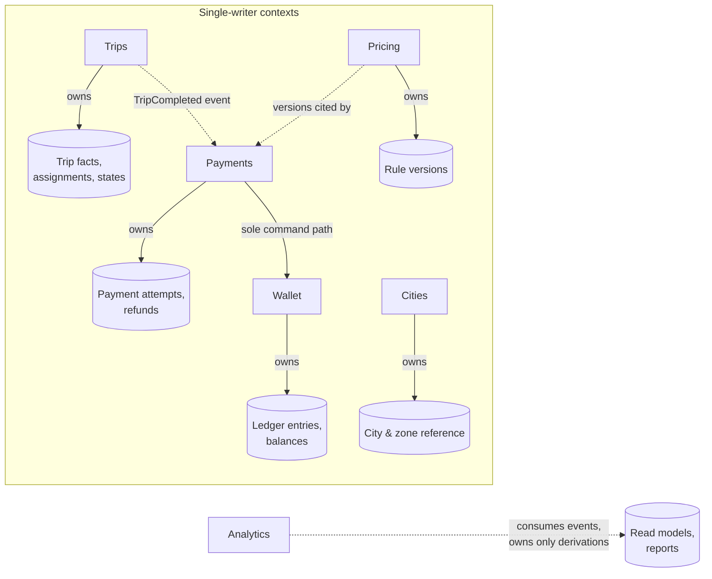
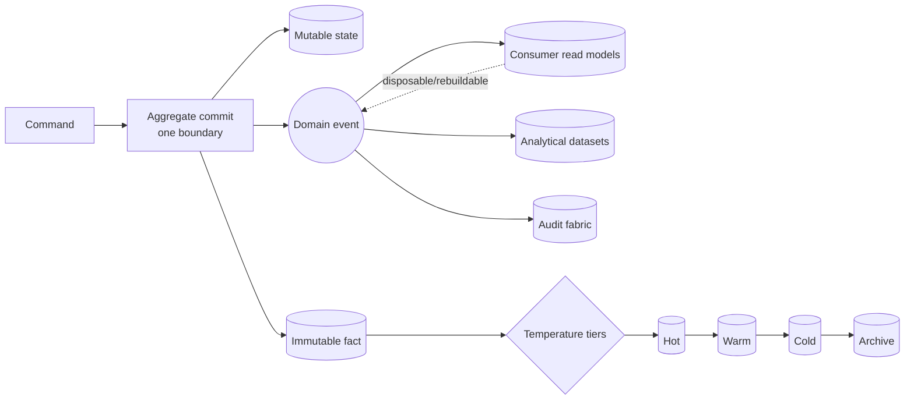
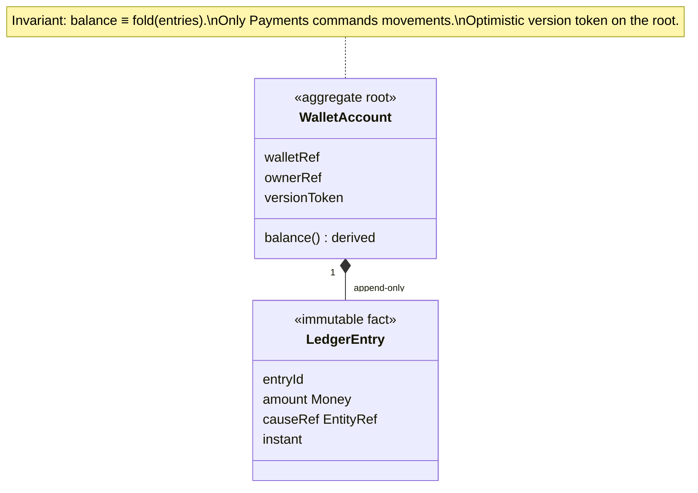
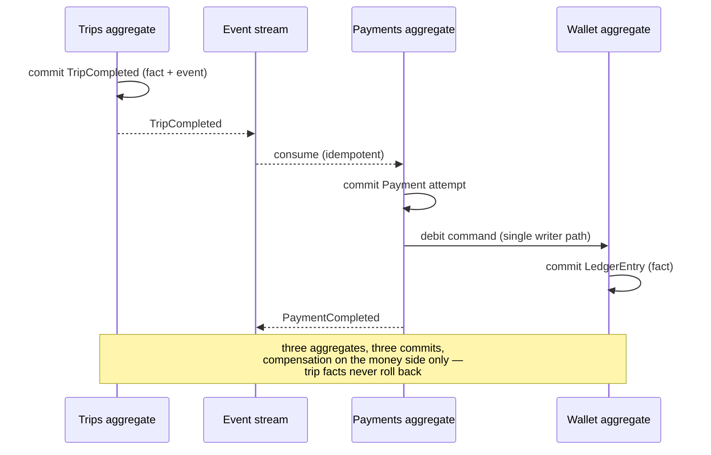

# ADR-004 — Data Architecture

**Status:** FINAL · **Owner:** Chief Enterprise Architecture · **Date:** 2026-07-18
**Depends on:** ADR-002 (Domain Model), ADR-003 (Globalization)
**Scope:** the canonical data architecture — principles only, completely
implementation-independent. No storage engines, query languages, or infrastructure
appear in this document.

> **Relationship to the prior corpus.** The enterprise data classification of
> `docs/ADR-004-data-architecture.md` remains the philosophical layer; this document is
> its canonical engineering expression aligned to the ADR-002 context decomposition.

---

## 1. Data Architecture Philosophy

Data is the platform's most durable asset: code will be rewritten, vendors replaced,
teams renewed — but a trip that happened in 2026 must still be true, reproducible, and
defensible decades later. The architecture therefore rests on one distinction applied
everywhere: **facts, state, and derivations are different kinds of information with
different rights.** Facts (what happened) are immutable forever. State (what currently
is) is replaceable, with its history preserved as facts. Derivations (what we compute)
are disposable and rebuildable. Every datum belongs to exactly one of these kinds, one
data class (§6), and one owning bounded context — and those three properties determine
everything else about it: who may change it, how it versions, how long it lives, and
how it is protected.

## 2. Why the Data Model Follows the Domain Model

The bounded contexts and aggregates of ADR-002 *are* the data model's structure: each
context owns its data exclusively; each aggregate is a consistency boundary; each
cross-context reference is an opaque identifier. Deriving data structure from anything
else — reporting convenience, storage habits, screen layouts — creates a second model
that drifts from the business and eventually contradicts it. There is one model. The
domain defines it; the data architecture gives it physical discipline; storage merely
hosts it.

## 3. Identity

- **Entity identity** is permanent and separate from attributes: an entity survives
  every attribute change, role change, and reorganization. Natural keys (phone numbers,
  plate numbers) are *uniqueness-constrained attributes used for lookup*, never
  identity — phones change owners; identity must not.
- **Global IDs**: every aggregate instance carries one opaque, globally unique,
  never-recycled, meaning-free identifier assigned at creation. Meaning encoded in
  identifiers rots; meaning belongs in attributes.
- **Aggregate IDs**: only aggregate roots are addressable. Interior entities are
  identified within their root (root ID + local identity) and are never referenced from
  outside the aggregate.
- **References between domains**: always *(Global ID + kind)* — the `EntityRef` value
  object of ADR-002 §7. Never copies of foreign data; never interior references.
  Possession of a reference conveys no rights over the referent: dereferencing goes
  through the owner's public interface.
- **External identifiers** (processor references, government numbers, provider place
  IDs) are stored as attributed claims mapped to platform identity — the platform never
  adopts a foreign namespace as its own.

## 4. Lifecycle, Facts, State, Versioning

- **Entity lifecycle**: created → active → (context-specific states) → closed. Lifecycle
  transitions are themselves recorded facts; an entity's past states are always
  reconstructible.
- **Immutable facts**: trips, ledger entries, payments outcomes, verdicts, acceptances,
  audit entries, domain events. Append-only. **Corrections are new facts that reference
  what they correct** — a wrong fare is fixed by an adjustment entry, never by editing
  the original.
- **Mutable state**: current profile, current vehicle status, current session set.
  Mutation is permitted only inside the owning aggregate, and every consequential
  mutation emits a change fact.
- **Versioning**: authored data (rules, pricing, configuration, catalogs, agreements)
  exists only as immutable versions. Publishing supersedes; it never edits.
- **Effective dating**: every authored version carries its effective interval;
  resolution is a pure function of *(key, scope, instant)*. Any historical question —
  "what price/rule/text applied at instant T?" — has exactly one reproducible answer.

## 5. Ownership Rules

- **Single writer**: each context is the only writer of its data; each aggregate the
  only transactional unit of it. Two writers for one datum is an architecture defect,
  not a tuning problem. Sharpened rules from ADR-002 §9 apply (only Payments moves
  Wallet value; telemetry becomes fact only when Trips adopts it).
- **Read models**: consumers needing another context's data at read-scale build their
  own read models from the owner's events — consumer-owned, declared, disposable, and
  rebuildable from event history at any time. A read model is never authoritative and
  never consulted by its owner.
- **Event-driven synchronization**: state propagates between contexts exclusively as
  published domain events consumed idempotently. Synchronization lag is a declared,
  monitored bound per read model — eventual consistency is a contract, not an accident.

## 6. Data Classification

| Class | Nature | Examples | Change regime |
|---|---|---|---|
| **Operational** | live working state | ride states, vehicle positions, offers, sessions | rapid in-place mutation permitted; short-lived; outcomes crystallize into facts |
| **Reference** | shared vocabulary | countries, cities, zones, locales, currencies, vehicle types | authored, immutable versions, effective-dated |
| **Configuration** | tunable behavior | pricing rules, market config, business policies, feature toggles | staged publish through the inheritance chain (ADR-003 §13) |
| **Analytical** | derived learning | aggregates, KPIs, report datasets | rebuilt from facts/events; never authoritative; provenance mandatory |
| **Audit** | record of privileged action | who did what, when, under which authority/rule version | append-only, write-once, custody separated from those it records |

Facts with financial/legal weight (trips, ledger, payments) are a hardened sub-class of
operational outcomes: immutable from creation, statutory retention.

## 7. Storage Philosophy (Temperature Tiers)

- **Hot** — data the platform touches in live operations (active rides, current
  balances, sessions, today's facts): optimized for the interactive path.
- **Warm** — recent history in routine product use (trip history, statements, recent
  audit): promptly readable, not latency-critical.
- **Cold** — aged facts kept for statutory and analytical purposes: retrieval may be
  slow, fidelity is total.
- **Archive** — the deep record: integrity-protected, restore-verified, immutable.
Movement between tiers changes cost and latency, **never truth, class, or
addressability** — an archived trip is still the trip, reachable by the same identity.
Tiering policy is declared per class, not improvised per crisis.

## 8. Deletion, Retention, Recovery, Legal Hold

- **Soft delete** is a *state*, not an erasure: the entity is closed/hidden, its facts
  intact — the default for anything referenced by history.
- **Hard delete** exists only as a **governed erasure event** with legal basis
  (privacy rights), executed as irreversible de-identification: personal identifiers
  are destroyed while non-personal facts survive (the trip happened; *who* rode is
  removable). Referential integrity survives via de-identified placeholders.
- **Retention** periods are declared per class and derived from the *maximum*
  obligation among the governing jurisdictions (ADR-003 §9); expiry triggers governed
  disposal, not silent decay.
- **Recovery** must restore data *with its class guarantees intact* — a recovered
  ledger is still append-only, a recovered audit trail still tamper-evident.
- **Legal hold** suspends disposal for named scopes with recorded hold-evidence; holds
  outrank retention expiry, and hold-vs-erasure conflicts escalate to governance with
  jurisdictional analysis — never silently resolved either way.

## 9. Audit Principles

Every privileged or consequential action appends an audit fact: actor, session,
subject, instant, prior-state reference, and — where gated — the authorizing rule
version. Audit custody is separated from every actor it records, including
administrators. Audit is write-once with tamper-evidence, readable only through
governed review, and retained on the longest statutory clock. The test: any past
decision can be reconstructed as *(who, what, when, under what authority)* without
interviewing anyone.

## 10–13. Concurrency, Transactions, Consistency

- **Concurrency philosophy**: correctness under concurrency comes from the model —
  never from assuming low traffic. Contention is resolved by *rules*, not luck: single-
  winner semantics for competitive actions (assignment acceptance), idempotency for
  retried commands (command identity makes re-execution detection, not duplication),
  and append-only escape from update conflicts wherever facts suffice.
- **Optimistic concurrency**: mutable aggregates carry a version token; a mutation
  states the version it read, and a stale token rejects the write cleanly for retry
  with fresh state. Losers of a race receive an honest conflict outcome, never a silent
  overwrite and never an unexplained failure. Pessimistic holding is the rare,
  declared exception for short critical decisions, never the default.
- **Transaction boundaries**: one command mutates **one aggregate atomically** — that
  is the entire transactional promise. Cross-aggregate and cross-context flows are
  processes: ordered local commits coordinated by events with declared compensation.
  The platform's oldest defect came from violating exactly this rule; it is not
  negotiable.
- **Aggregate consistency**: invariants hold *within* an aggregate at every commit
  (ledger balances, single active rental, assignment single-winner). *Between*
  aggregates, consistency is eventual with declared bounds. Aggregates are sized by
  invariant necessity — as small as possible, as large as their invariants require.

## 14. Partitioning Philosophy

Partition along the domain's own keys, decided at design time: operational data by
**City** (the natural blast-radius and load unit — ADR-003 §10), personal data by
**User**, tenant data by **Organization**, facts additionally by **time**. Partitions
align with ordering guarantees (per-subject) and with residency requirements
(jurisdictional placement). Hot-spot relief is sub-partitioning of busy subjects — a
data decision, never an architecture change.

## 15. Indexing Philosophy

Indexes exist to serve *declared access paths*: each context states how its data is
looked up (by identity, by owner, by natural-key lookup, by time window), and those
declarations — not ad-hoc query archaeology — justify every index. Write-heavy fact
streams stay lean; read models absorb rich lookup needs. An index no declared path
uses is removed.

## 16. Search Philosophy

Search (fuzzy, linguistic, geospatial discovery) is a **derived capability** built from
events into purpose-shaped search models — never a bolt-on against authoritative state.
Search results are pointers (`EntityRef`s) resolved through owners; search indexes are
disposable and rebuildable; locale-aware matching follows ADR-003's localization rules.
Authoritative data never bends its shape to make search convenient.

## 17. Reporting Philosophy

Reports are certified derivations: built from facts/events with recorded provenance
(sources, recipe version, build instant), rolled up along the geographic spine
(City → Market → Country), rendered per locale, and **never produced by burdening the
operational path**. A number on a report that cannot be traced to facts is a defect.
Regulatory reports additionally cite the rule versions they satisfy.

## 18. Historical Data Philosophy

History is a first-class product of the platform, not exhaust: superseded versions,
closed facts, and emitted events together allow *any past state to be reconstructed and
any past decision to be replayed*. Nothing rewrites history — migrations transform
representations, never truths, and every migration is verified by demonstrating that
historical questions return unchanged answers before and after.

## 19. Backup Philosophy

Backups are tiered by class criticality: the operational truth most frequently (bounded
data-loss objective), full sets on slower cadences, with retention ladders. Every
backup is integrity-verified at creation, encrypted for hostile storage, and —
non-negotiably — **restore-tested automatically on cadence**: a backup that has not
proven it restores is a hope, not a backup. Secret material is never captured in
backups; configuration backups capture structure and checksums, never secret values.

## 20. Disaster Recovery Principles

Declared recovery objectives per class (loss bound and time-to-restore), rehearsed —
recovery objectives are *measured drill results*, not aspirations. Recovery restores
class guarantees (§8), proceeds by runbook, and prefers *resume and reconcile* (from
durable facts and process state) over *reconstruct and guess*. Off-site custody of the
archive tier is mandatory for true disaster survival; the encryption custody rule means
losing key custody equals losing the backups — key custody is therefore part of the DR
plan itself.

## 21. Diagrams

### 21.1 Domain ownership (single writer)

### 21.2 Data flow (fact → derivation)

### 21.3 Aggregate boundary

### 21.4 Event flow (settlement, separate commits)

## 22. Decision

Adopted as FINAL. Every feature declares, per datum it introduces: kind (fact/state/
derivation), class, owning context and aggregate, partition key, retention, and audit
obligations — or it does not merge.

---

*ADR-004 — Data Architecture. Governed by `architecture/README.md`; amendments follow
the standing amendment pattern.*
