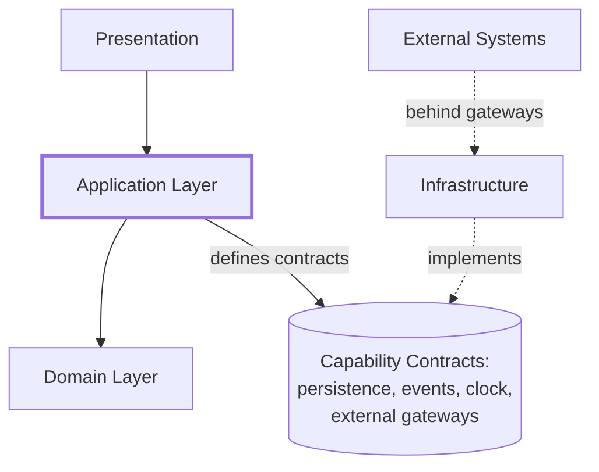
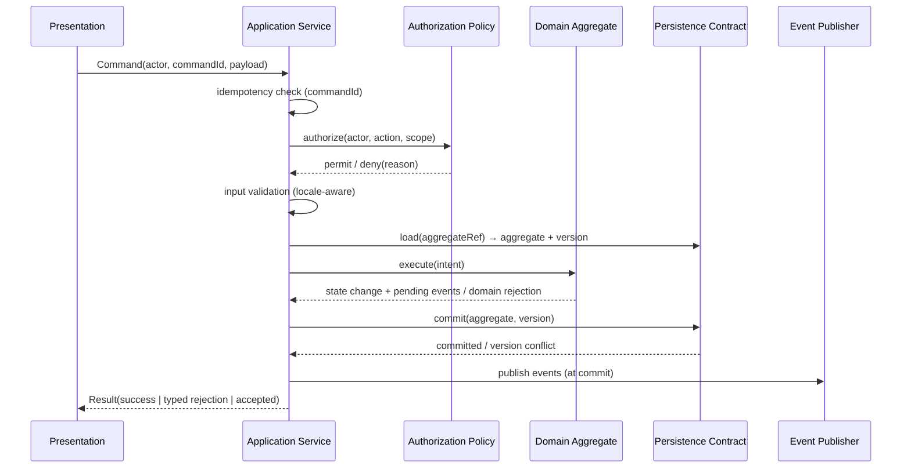
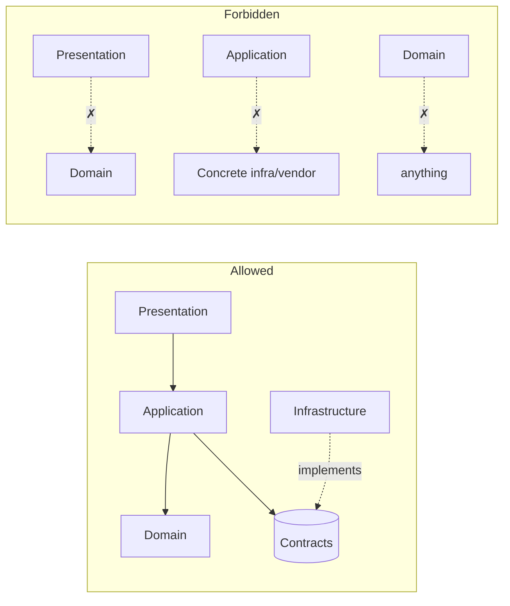
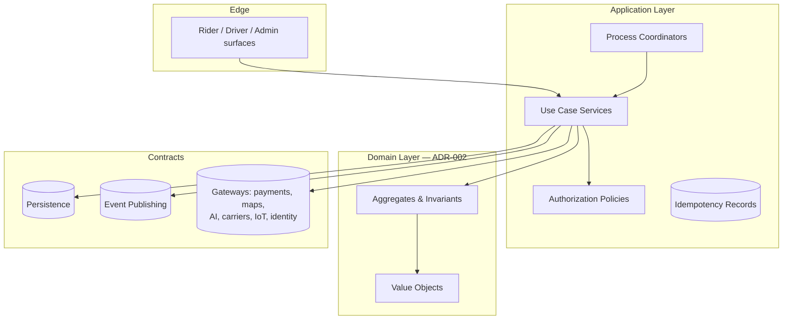
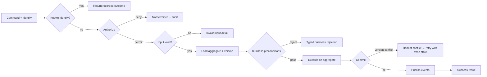
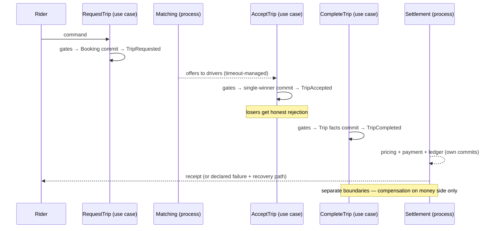
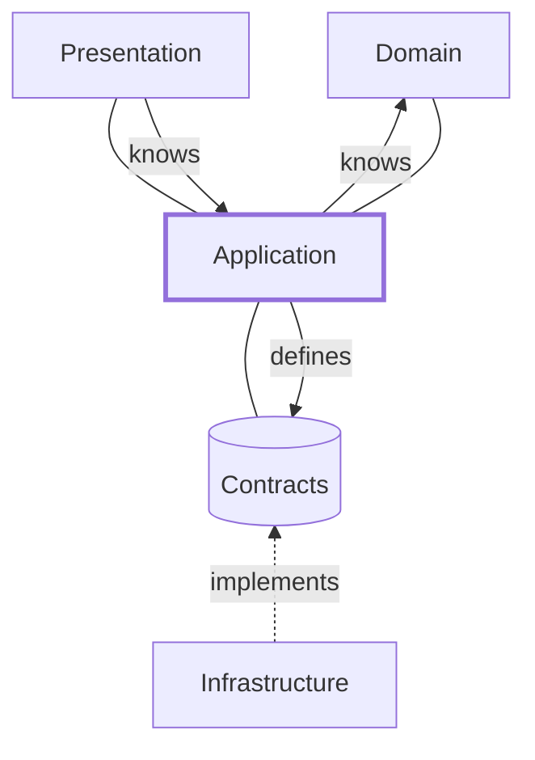

# ADR-005 — Application Architecture

**Status:** Proposed · **Owner:** Principal Software Architecture · **Date:** 2026-07-18
**Depends on:** G0.0 (Evolution Strategy) · ADR-002 (Domain Model) · ADR-003
(Globalization) · ADR-004 (Data Architecture)
**Scope:** the Application Layer of the OnCall platform — every current vertical
(scooter rental, taxi, ride hailing, fleet, drivers, passengers, payments, wallet,
notifications, maps, IoT, AI) and every future mobility service. Technology-independent
by rule.

---

## 1. Purpose

The Application Layer is the platform's **conductor**: it turns actor intent into
business outcomes by orchestrating the domain. It is the only layer that knows the full
shape of a use case — which gates apply, which aggregate is mutated, which events are
published, and what the caller is told.

**Responsible for:** receiving commands and queries from the presentation edge;
enforcing the gate sequence (authorization → business validation → execution); defining
transaction boundaries; coordinating cross-context processes; publishing events;
translating outcomes (success, rejection, failure) into honest results.

**MUST NOT:** contain business rules (those live in the Domain Layer — the application
*asks* the domain, never decides for it); know how data is stored; know how requests
arrive or responses render; know which vendor fulfills an external capability. The
Application Layer that knows too much becomes un-testable and un-evolvable — thinness
is its virtue.

## 2. Architectural Position

```
Presentation   — captures intent, renders outcomes; knows nothing of business
     ↓
Application    — use cases, orchestration, gates, boundaries, events
     ↓
Domain         — business rules, invariants, aggregates (ADR-002)
     ↓
Infrastructure — fulfills persistence/messaging/delivery contracts
```

**Dependency direction is strictly downward, with inversion at the bottom:** the
Application Layer depends on the Domain and on *contracts it defines* for
infrastructure capabilities; Infrastructure implements those contracts and depends
upward on their definitions — never the reverse. Presentation depends on the
Application Layer's use-case interfaces and on nothing deeper. No layer ever reaches
around an adjacent layer.



## 3. Responsibilities

- **Orchestration** — sequencing the steps of a use case: gates, domain calls,
  persistence coordination, event publication; and coordinating multi-step processes
  across aggregates and contexts.
- **Use cases** — one named application service operation per business capability (§5),
  each a complete, self-describing unit of intent.
- **Transactions** — opening and closing exactly one atomic boundary per command,
  around exactly one aggregate (ADR-004 §12).
- **Coordination** — driving long-running processes (matching, settlement, onboarding)
  as sequences of local commits with process state, timeouts, and compensation.
- **Validation** — running the three validation kinds (§10) in order, rejecting early
  and honestly.
- **Authorization** — evaluating policy before any domain logic executes (§11): an
  unauthorized caller never reaches business code.
- **Persistence coordination** — loading aggregates through their contracts, committing
  through the same; the application decides *when* to persist, never *how*.
- **Event publishing** — emitting domain events at commit (never before) and
  integration events at boundary crossings (§12).
- **Integration orchestration** — invoking external capabilities through gateways
  (§13), translating their outcomes into use-case results, and never letting external
  vocabulary pass through.

## 4. What Does NOT Belong Here

Explicitly prohibited inside the Application Layer:

| Prohibited | Where it belongs |
|---|---|
| Business rules ("may a suspended driver accept?") | Domain Layer (aggregates, ADR-002) |
| Database logic (how data is fetched or stored) | Infrastructure, behind persistence contracts |
| Framework logic of any kind | Presentation edge / Infrastructure adapters |
| Transport/protocol handling (request parsing, connection management) | Presentation edge |
| Realtime socket/channel mechanics | Presentation edge / Infrastructure |
| Vendor SDK calls | Infrastructure gateways (anti-corruption) |
| IoT device protocol handling | IoT gateway (ADR-002 IoT context boundary) |
| Query-language text of any form | Infrastructure, behind declared access paths (ADR-004 §15) |

The test: an application service must read as a business narrative. Any line a domain
expert could not follow is in the wrong layer.

## 5. Use Cases

A **Use Case** is one named, complete business capability executed on behalf of one
actor: a verb phrase in the ubiquitous language, with declared inputs, gates, outcome
set (including failures), events, and idempotency behavior. Use cases are the
platform's public application vocabulary — Presentation invokes them, tests certify
them, ADRs reference them.

Catalog (representative, by context — each maps to its ADR-002 owning context):

- **Identity:** Register User · Login · Refresh Session · Logout / Revoke Sessions ·
  Verify Identity
- **Taxi / Ride hailing:** Request Trip · Accept Trip (single-winner) · Reject Trip ·
  Cancel Trip · Start Trip · Complete Trip · Rate Trip · Track Trip
- **Scooters:** Unlock Scooter · Start Ride · Pause Ride · Resume Ride · End Ride ·
  Report Vehicle Problem
- **Fleet / Vehicles:** Register Vehicle · Approve Vehicle · Retire Vehicle · Record
  Inspection
- **Drivers:** Apply as Driver · Approve Driver · Suspend Driver · Reactivate Driver ·
  Go Online / Offline
- **Passengers / Users:** Update Profile · Set Locale · Manage Consents · Suspend User
  (admin)
- **Payments / Wallet:** Charge Wallet (top-up) · Capture Payment · Refund · Query
  Balance & Statement
- **Notifications:** Send Push · Send SMS · Send Email (all template + locale resolved,
  event-triggered or operator-initiated)
- **Admin:** Suspend User · Activate Driver · Approve Vehicle · Publish Configuration ·
  Resolve Report
- **Analytics:** Generate Reports · Query Certified Datasets (read-only by
  construction)

New verticals add use cases; they never add new *kinds* of application machinery.

## 6. Use Case Lifecycle

Every command use case executes the same canonical lifecycle — uniformity is what makes
the platform auditable and testable:

1. **Receive** — a command arrives from Presentation with actor identity and command
   identity (for idempotency) attached.
2. **Authenticate context** — the actor's session/identity is already verified at the
   edge; the application re-derives *authority*, never trusts claims.
3. **Authorize** — policy evaluation (§11). Failure → `NotPermitted`, audited.
4. **Validate input** — shape, ranges, formats (locale-aware per ADR-003). Failure →
   `InvalidInput` with field detail.
5. **Load** — the target aggregate is loaded via its persistence contract, with its
   concurrency token (ADR-004 §11).
6. **Validate business preconditions** — the domain answers whether the action is
   legal in the current state. Failure → typed business rejection.
7. **Execute** — the aggregate performs the state change; invariants hold or the
   operation throws a domain rejection.
8. **Commit** — one atomic boundary: state + facts + event publication intent.
9. **Publish** — domain events emit at commit; integration events where boundaries are
   crossed.
10. **Respond** — an honest result: success payload, typed rejection, or
    `AcceptedForProcessing` with a process handle for long-running flows.



## 7. Command Model

- **Commands** are immutable intent messages: actor, command identity, target
  aggregate reference, payload of value objects (ADR-002 §7). One command targets one
  aggregate — by definition, not by convention.
- **Command handlers** are the application services of §5: exactly one handler per
  command; the handler owns the full §6 lifecycle for that command. Handlers are
  stateless between invocations; all state lives in aggregates and process records.
- **Command validation** happens in three passes (§10) with fail-fast ordering:
  cheapest and most certain first (shape), then authority, then business state. A
  command that will fail must fail before any side effect.
- **Command identity** makes every command idempotent-capable (§15): redelivery of the
  same command identity is detected, and the original outcome is returned.

## 8. Query Model

Queries answer questions; they **never mutate** anything — not state, not counters,
not "last accessed" side effects. Queries are served from **read models**: consumer-
shaped projections built from domain events (ADR-004 §5), each with a declared owner
and freshness bound.

Reads and writes are separated *conceptually* because they have opposite needs: writes
require invariants, strict boundaries, and current state; reads require shapes,
breadth, and speed. Fusing them forces one model to serve both masters badly — write
models grow query conveniences that corrupt invariant clarity, and read paths acquire
locking costs they never needed. Separation lets each side evolve independently: a new
screen adds a projection, never a schema-of-record change; a new invariant tightens an
aggregate, never a report. Where a use case needs an authoritative read (balance before
charging), it queries the owner's aggregate through its contract — declared as such,
because authoritative reads are the expensive exception, not the norm.

## 9. Transaction Management

- **Atomicity** — one command commits one aggregate atomically: state change, fact
  records, and event publication intent succeed or fail together. Nothing else is ever
  inside that boundary.
- **Consistency** — aggregate invariants hold at every commit (ADR-004 §13);
  cross-aggregate consistency is eventual with declared bounds, reached through events.
- **Compensation** — any flow spanning boundaries declares its counter-actions *before
  it ships*: settlement failure compensates on the money side (ride facts never roll
  back); onboarding reversal withdraws supply and notifies. Compensation is a designed
  path, executed by the same use-case machinery, audited like everything else.
- **Retries** — bounded, for transient failures only, idempotent by construction, with
  escalation to a declared failure state. Never infinite, never silent.
- **Idempotency** — see §15; the property that makes retries and redelivery safe.

## 10. Validation

Three kinds, three owners, strict order:

1. **Input validation** (application, at entry): structural truth — required fields,
   value-object well-formedness, locale-aware formats (phone/address per ADR-003).
   Answers: *is this a coherent request?*
2. **Authorization validation** (policy, before any business logic): *may this actor do
   this to this subject in this scope now?* (§11).
3. **Business validation** (domain, inside the aggregate): *is this action legal in the
   current state?* — a suspended driver cannot accept; an expired booking cannot be
   assigned; a wallet cannot go below its floor. Business validation lives with the
   invariants it protects, never duplicated upward.

Each kind produces its own typed rejection; conflating them destroys both security
clarity (was it forbidden or just malformed?) and user experience (what should the
caller fix?).

## 11. Authorization

**Policy-based:** authorization decisions are named policies evaluated by the
application before execution — not inline conditionals scattered through handlers. A
policy composes, in order: **role capability** (may this kind of actor ever perform
this action?), **ownership validation** (is the subject theirs? — a passenger reads
*their* trips; a driver acts on *their assigned* ride; an organization manager acts
within *their* organization), **permission validation** (fine-grained grants, scoped to
market/city/organization and time-boxed where elevated), and **contextual/regulatory
predicates** (jurisdictional gates per ADR-003 §4, e.g. driver-standing requirements).
The composite is: *authority = role ∩ ownership ∩ permission ∩ context*, default-deny
at every term. Every grant and every denial of a consequential action is audited with
the policy decision recorded (ADR-004 §9).

## 12. Events

Three kinds with distinct responsibilities:

- **Domain events** — past-tense business facts owned by a context (`TripCompleted`,
  `DriverApproved`; canonical set in ADR-002 §8). Published by the application at
  commit of the owning aggregate — never before, never maybe. They are the integration
  backbone and part of the permanent record (ADR-004).
- **Application events** — use-case-level occurrences that are not domain facts:
  `CommandRejected`, `ProcessTimedOut`, `CompensationExecuted`. They feed
  observability, auditing, and process management; they do not cross context
  boundaries as business truth.
- **Integration events** — the *published-contract* form of domain events for external
  or cross-boundary consumers: versioned, certified, carrying references not payloads,
  translated at gateways where external parties are involved.

Application Layer responsibilities: publish at the right moment (commit), exactly one
producer per event kind, additive-only evolution, and idempotent consumption when
acting as a subscriber (process triggers, notification dispatch).

## 13. External Integrations

All external capabilities are consumed through **gateways** — application-defined
contracts implemented in Infrastructure, with anti-corruption translation at the
boundary (ADR-002 §10.5):

- **Payments processors** — the gateway speaks "authorize / capture / refund /
  outcome"; processor-specific states and references are translated into the Payment
  aggregate's lifecycle and stored as attributed external claims.
- **Maps / geospatial providers** — place resolution, routing, and estimated arrival
  as *advisory* answers; provider identifiers never become platform identity.
- **AI capabilities** — advisory interfaces per registered decision class (ADR-002 AI
  context): the application consumes advice with confidence, applies decision-class
  rules (assist vs. act-within-envelope), and always holds the deterministic fallback.
- **Notification carriers** — the gateway accepts a localized, rendered message and
  returns delivery outcomes; carrier mechanics stay outside.
- **IoT devices** — commands to and telemetry from hardware pass the IoT boundary;
  telemetry arrives as claims and becomes fact only when the owning context adopts it.
- **Identity providers** — external verification services return evidence and
  outcomes; the platform's Identity context remains the authority on identity itself.

Rule for all: the gateway contract is written in **platform vocabulary**; a vendor
change reimplements a gateway and touches zero use cases.

## 14. Error Handling

Four failure families, four disciplines:

- **Expected failures** (business rejections): typed, enumerated per use case, part of
  the contract — `InsufficientBalance`, `TripAlreadyAssigned`, `DriverSuspended`. They
  are *outcomes*, not exceptions; they return cleanly with reasons the caller can act
  on, localized per ADR-003.
- **Business failures** (process-level): a declared step of a long-running flow fails
  legitimately — payment declined, no driver found. The process moves to its declared
  failure state, compensation runs where defined, and the actor is informed honestly.
- **Infrastructure failures** (transient or environmental): timeouts, unavailable
  capabilities. Retried within bounds (§16), then surfaced as
  `TemporarilyUnavailable` — never disguised as business rejections.
- **Unexpected failures** (defects): invariant violations, impossible states. The
  operation aborts with the boundary rolled back, full context is captured for
  engineering, the caller receives a generic failure with a correlation reference —
  and the occurrence is treated as a defect to fix, never normalized.

Rule: **no lying results.** A caller can always distinguish "you may not", "you
cannot yet", "we cannot right now", and "we broke" — because those four demand
different responses from humans.

## 15. Idempotency

**Why:** commands travel unreliable paths — mobile retries, timeouts with unknown
outcomes, redelivered messages. Without idempotency, every retry risks a double charge,
double unlock, or double trip; the platform's money and safety semantics make that
intolerable.

**When required:** every command that mutates state — universally, not selectively.
Queries are naturally idempotent. Event consumption must be idempotent per consumer
(redelivery is normal).

**How the layer behaves:** every command carries a caller-supplied command identity;
the application records *(command identity → outcome)* within the commit boundary;
re-receipt of a known identity returns the recorded outcome without re-execution.
Natural idempotency is preferred where the domain allows (setting a state is
re-runnable; appending is not — so appends are always identity-guarded). Time-bounded
retention of idempotency records is declared per use case, aligned to realistic retry
horizons.

## 16. Resilience

- **Retries** — application-level retries target transient infrastructure failures
  only; bounded attempts, spaced with restraint, always idempotent, always ending in a
  declared state (success or typed failure). Business rejections are never retried —
  they are answers.
- **Timeouts** — every outbound interaction and every process step carries one;
  "no timeout" is not a configuration option. A timeout is a modeled outcome with a
  next step (retry, park, compensate, or fail honestly).
- **Circuit isolation (conceptual)** — repeated failure of an external capability flips
  its gateway into a declared degraded mode (defer work, park it with evidence, or
  reject honestly) instead of hammering a failing dependency; the gateway probes for
  recovery and restores itself. Degraded modes are designed per gateway — deferred
  settlement is the canonical example.
- **Compensation** — the resilience of multi-step flows: when a later step cannot
  succeed, declared counter-actions restore business coherence (§9). Parked work is
  inventory with an owner and an age limit, never a landfill.

## 17. Testing Strategy

- **Unit testing (domain):** aggregates and policies tested in pure isolation — given
  state, when intent, then outcome/invariant. No contracts, no boundaries mocked
  because none are needed.
- **Application testing (use case):** each use case tested through its public surface
  with contract doubles for persistence/gateways: gate order, boundary correctness,
  event emission, idempotent re-execution, every declared rejection path. This suite
  is the platform's behavioral specification.
- **Integration testing:** real contract implementations exercised against real
  (test-scoped) capabilities — persistence round-trips with concurrency tokens, event
  publish/consume, gateway translation fidelity.
- **End-to-end testing:** full journeys through presentation to outcome — request →
  match → ride → settle — including race scenarios (concurrent acceptance, concurrent
  completion) and failure/compensation paths. Race tests are mandatory for every
  single-winner and money-touching flow; the platform's history makes this
  non-negotiable.

Test data respects ADR-003: multi-locale fixtures, RTL rendering checks at the edge
suites, and multi-currency amounts in money paths.

## 18. Dependency Rules

**Allowed:**
- Presentation → Application use-case interfaces (only).
- Application → Domain (aggregates, policies, value objects).
- Application → capability contracts *it defines* (persistence, event publishing,
  clock/randomness, gateways).
- Infrastructure → those contract definitions (implementation direction).
- Domain → nothing above it; pure.

**Forbidden:**
- Presentation → Domain or Infrastructure directly.
- Application → any concrete infrastructure, framework, transport, vendor, or storage
  detail.
- Domain → Application, Infrastructure, Presentation, or any contract.
- Infrastructure → Domain internals (it persists aggregates through their declared
  shapes, never reaches into invariants).
- Anything → another context's interiors (ADR-002 §10: events, owner commands, or
  certified queries only).
- Cyclic dependencies of any kind, at any granularity.



## 19. Architecture Principles

1. One use case, one application service operation, one owner.
2. One command, one aggregate, one atomic commit.
3. Gates before acts: authorize → validate input → validate business — always in that
   order, always fail-fast.
4. The application orchestrates; the domain decides.
5. Queries never mutate.
6. Reads and writes are separate models with separate evolution.
7. Events are published at commit — never before, never speculatively.
8. Exactly one producer per event kind; consumers are idempotent and replay-tolerant.
9. Every mutating command is idempotent via command identity.
10. Every cross-boundary flow ships with declared compensation.
11. Every outbound interaction has a timeout; every timeout has a next step.
12. Business rejections are outcomes, not errors; infrastructure failures are never
    disguised as business answers.
13. External vocabulary dies at the gateway.
14. Deterministic fallbacks exist for every advisory (AI) input.
15. Long-running work has durable process state, an owner, and a timeout.
16. Nondeterminism (time, randomness) enters only through injectable contracts.
17. Authorization is policy, not scattered conditionals; default-deny throughout.
18. All consequential decisions and denials are audited with their policy verdicts.
19. The application layer contains no line a domain expert could not read.
20. New verticals add use cases and data — never new kinds of machinery.

## 20. Diagrams

### 20.1 Layer diagram



### 20.2 Application execution flow (command)



### 20.3 Use case lifecycle across a process (ride → settlement)



### 20.4 Dependency direction



---

## Decision

Adopt this Application Architecture. Every use case implemented on the platform must
be traceable to §5's catalog (or extend it by amendment), execute the §6 lifecycle, and
satisfy the §18 dependency rules and §19 principles. Conformance is verified in code
review and by the §17 application test suite.

*ADR-005 — Application Architecture. Governed by `architecture/README.md`; amendments
follow the standing amendment pattern.*
