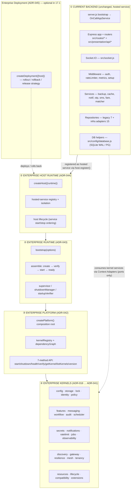
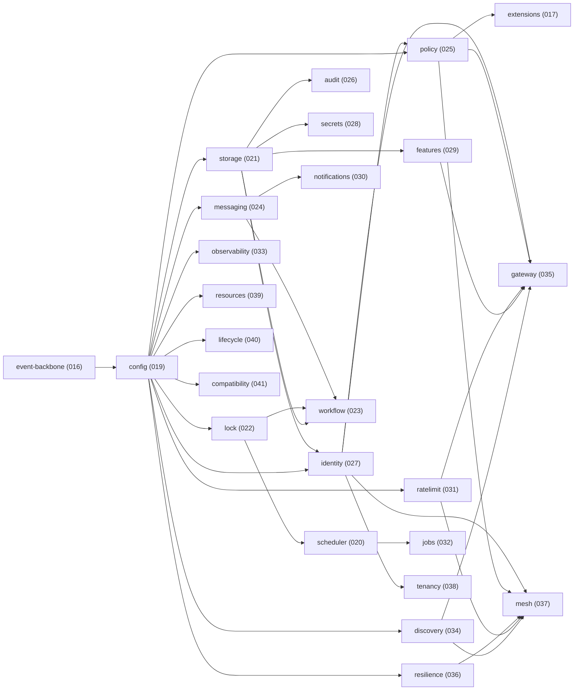
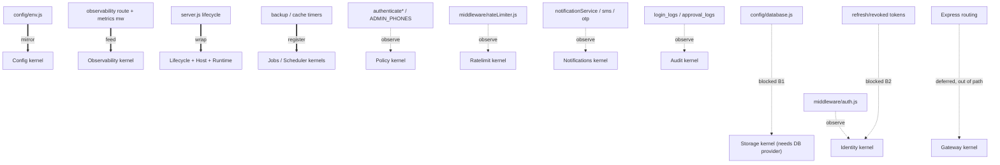
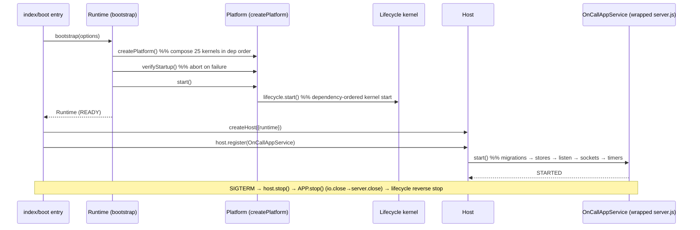

# Phase 17.1 — Dependency Graph (STEP 3)

Shows the required layering:
**Current backend → Enterprise Runtime → Enterprise Platform → Enterprise Kernels.**
Diagrams are Mermaid (renders in the repo's Markdown viewer, consistent with `docs/diagrams`).

---

## 1. Target Layering (the four mandated tiers)

**Reading the graph:** the app plugs in **once**, at the Host, as a hosted service. Control
flows down (Deployment → Host → Runtime → Platform → Kernels); the app additionally reaches
kernels **only through adapters that call public kernel ports** (dashed line) — never by
importing kernel internals, mirroring the Platform's own no-cross-import rule.

---

## 2. Kernel Composition Order (as the Platform builds it)

Derived from `src/platform/platformBuilder.js` `KERNELS` catalog and its topological sort.
Arrows mean "must be composed/started before."

`event-backbone` and `config` are the roots; **`config` is the universal dependency**, which
is why Config is the safest first kernel the app consumes. `lifecycle` orchestrates
start/stop of all the others; `gateway` and `mesh` are the deepest composites (they take
other kernels as injected `ports`).

---

## 3. App-Component → Kernel Consumption Edges (Phase 17.1 target)

Only the edges that Phase 17.1 introduces (wrap + observe). Solid = wrap-now; dashed =
observe-only (no request-path change); dotted = blocked/deferred.

The two dotted "blocked" edges (Storage-owns-DB, Identity-owns-tokens) are the gates in the
Readiness Report; the deferred Gateway edge is intentionally kept out of the request path in
17.1.

---

## 4. Runtime Call/Control Sequence (target boot)

This sequence preserves the app's current ordering constraint — **migrations complete before
`server.listen`** — by making it the hosted service's `start()` contract, now enforced by the
Host/Lifecycle rather than by statement order in `server.js`.
