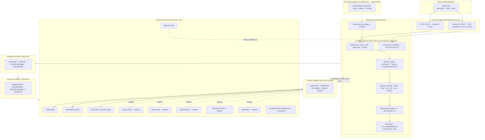
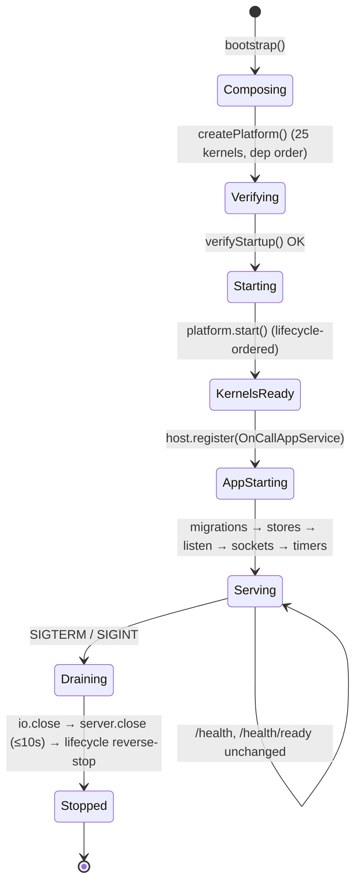
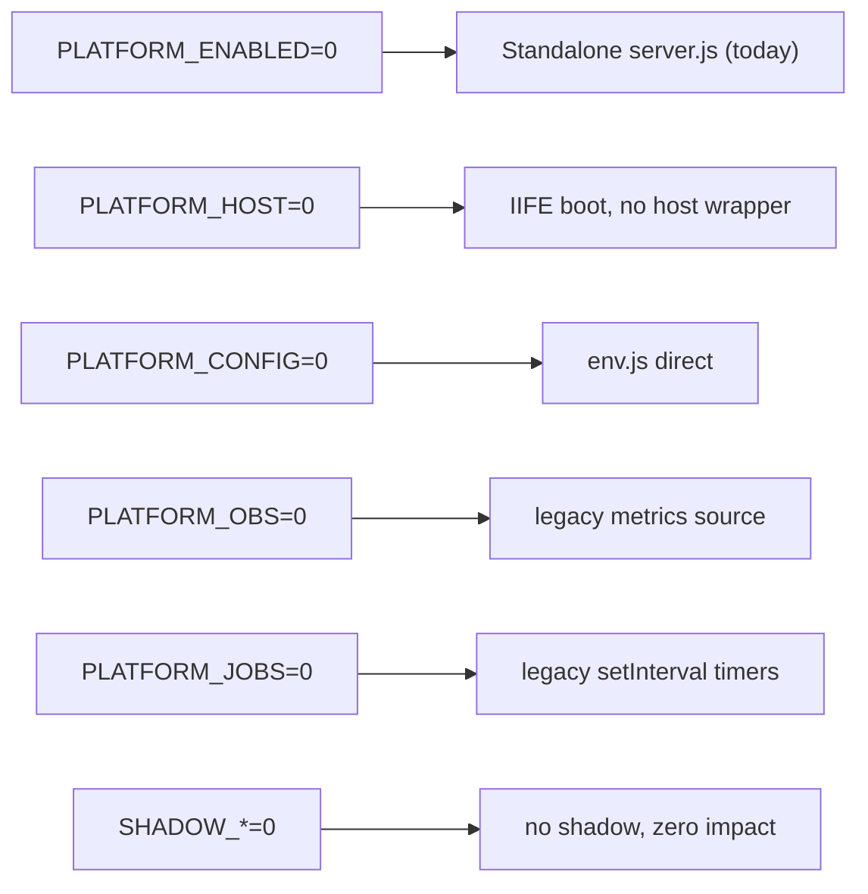

# Phase 17.1 — Target Architecture Diagram

The end-state of Phase 17.1: the **unchanged** OnCall backend running as a single isolated
hosted service on top of the Enterprise Platform, consuming kernels only through adapters that
call public ports. Flutter clients, routes, responses, schema, auth, and Socket.IO are
untouched.

---

## 1. Layered Target Architecture



**Solid** kernel links (config, observability, jobs, lifecycle) = active wrap-now consumers.
**Dashed** links (identity, policy, ratelimit, notifications, audit) = observe-only shadows —
present, computing, compared, but never in the served path. Storage/lock/secrets/etc. are
composed for a healthy Platform but have no app adapter in 17.1.

---

## 2. Request Path (proves external behavior is unchanged)

```mermaid
sequenceDiagram
    participant FL as Flutter
    participant EX as Express (src/routes / presentation)
    participant MW as auth + rateLimiter (unchanged)
    participant DB as db helpers (SQLite/PG)
    participant SH as Kernel shadows (async, off-path)

    FL->>EX: HTTP request (same route)
    EX->>MW: authenticate + rate limit (verifyJWT, legacy)
    MW->>DB: query (unchanged SQL)
    DB-->>EX: rows
    EX-->>FL: SAME response body / status / headers
    MW-->>SH: (async, sampled) mirror inputs to Identity/Ratelimit shadows
    Note over SH: shadow computes + compares; NEVER affects the response
```

The served path is identical to today. Kernel involvement is strictly a side-channel
(dashed), so no route or response can change — satisfying the phase's hard compatibility
rules.

---

## 3. Lifecycle Ownership (boot & shutdown)



The app's original ordering constraint — **migrations before `server.listen`** — becomes the
hosted service's `start()` contract, now enforced by Host + Lifecycle instead of statement
order, with identical observable results and identical shutdown behavior.

---

## 4. Rollback View (every coupling is a flag)



Any box on the right is reachable by a single flag flip + restart — no code change, no
migration, no client impact.
