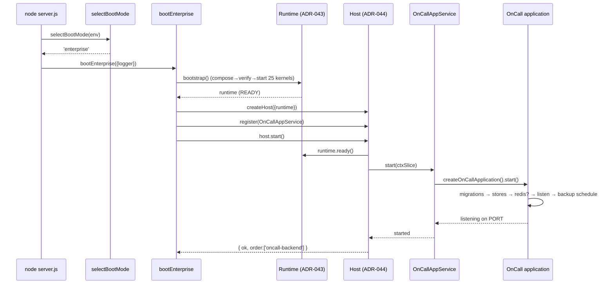

# Phase 17.2 — Startup Sequence

The required startup order is **preserved exactly** in both modes, because both run the same
`createOnCallApplication().start()`. The only addition in Enterprise mode is that the
Platform/Runtime becomes ready *before* the application starts.

---

## 1. Application startup order (identical in both modes)

Enforced inside `src/app/onCallApplication.js` — construction wires Environment→Socket.IO→
Routes synchronously (as the legacy module body did); `start()` runs the async tail:

```
Environment        require('../config/env')  — fail-fast on missing JWT_SECRET   [construct]
   ↓
Database           require('../config/database') — sqlite/PG helpers + PRAGMAs    [construct]
   ↓
Socket.IO          new Server(...) + setupSocket(io, services)                    [construct]
   ↓
Routes             app.use(... legacy/layered routers by *_LEGACY flags ...)      [construct]
   ↓  ── start() ──
Migrations         await runMigrations(dbRun, logger)      ← BEFORE listen (C6)
   ↓
Revocation Store   await initRevocationStore(dbRun, dbAll)  (P6-05A)
   ↓
Rate Limit Store   await initRateLimitStore(dbRun, dbAll)   (P6-05B)
   ↓
Redis (optional)   if REDIS_URL: attach socket adapter + revocation pub/sub
   ↓
WAL timer + ghost-trip cleanup (SQLite bounds; startup hygiene)
   ↓
HTTP Listen        await server.listen(PORT)               ← resolves start()
   ↓
Background Jobs    startBackupSchedule(dbRun, logger)
```

The ordering constraint that migrations complete **before** `server.listen` is retained
verbatim — it is simply now the resolution contract of `start()`.

## 2. Legacy mode

```
node server.js
  → selectBootMode(env) === 'legacy'
  → createOnCallApplication()          // construct (Environment…Routes)
  → application.start()                // Migrations…Background Jobs (order above)
  → install SIGTERM/SIGINT + crash guards (verbatim legacy handlers)
```

## 3. Enterprise mode

```
node server.js  (PLATFORM_ENABLED=1, PLATFORM_HOST=1)
  → selectBootMode(env) === 'enterprise'
  → bootEnterprise():
      1. bootstrap(options)            // ADR-043: createPlatform() → verify → start (25 kernels)
      2. createHost({ runtime })       // ADR-044
      3. createPlatformAdapters({})    // inert adapter layer
      4. createOnCallAppService({adapters})
      5. host.register(service)        // §2 contract validated
      6. host.start():
           runtime.ready()             // Platform confirmed ready FIRST
           service.start()             // → createOnCallApplication().start()  (order above)
      7. install SIGTERM/SIGINT (host.stop) + crash guards
```

Net effect: the Enterprise path wraps the identical application startup with a
Platform-ready gate in front. Kernels are memory-only and hold no app state, so they add no
behavior — only lifecycle orchestration and readiness/health aggregation.

## 4. Sequence diagram (Enterprise)



## 5. Verification of ordering
- `tests/unit/hosted-service.test.js` asserts the fake application's `start` is called
  exactly once via `host.start()`, and `ready()` transitions false→true only after start.
- The migrations-before-listen guarantee is preserved by keeping the entire async tail in one
  `start()` that resolves on the `listen` callback (post-migration), unchanged from legacy.
