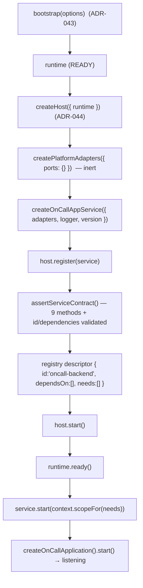

# Phase 17.2 — Host Registration Flow

How the single `OnCallAppService` is registered into `createHost()` and driven through its
lifecycle. Exactly one hosted service is introduced; no others.

---

## 1. Flow



## 2. What `host.register()` validates

From `src/host/hostRegistry.js`:
- the service is an object implementing all nine `CONTRACT_METHODS`
  (`id, name, version, dependencies, start, stop, health, verify, metadata`);
- `id()` returns a non-empty string (`'oncall-backend'`);
- `dependencies()` returns an array (`[]`);
- the id is unique in the registry (duplicate → `DuplicateServiceError`).

A descriptor is derived: `{ id, name, version, dependsOn: [], ports: [], needs: [], metadata }`.
`needs: []` means the Host injects **no** context slice into `start()` — OnCall builds its own
configuration from env, unchanged.

## 3. Dependency ordering

The Host reuses the ADR-042 dependency graph over hosted-service descriptors. With a single
service and no dependencies, startup order is `['oncall-backend']` and shutdown order is its
reverse — trivially valid. `host.verify()` confirms:
`runtimeHealthy`, `allServicesVerified`, `dependencyGraphValid`, `startupOrderValid`,
`shutdownOrderValid`, `contractsValid`.

## 4. Registration code (src/enterprise/index.js)

```js
const runtime  = await bootstrap({ logger, environment, version }); // ADR-043
const host     = await createHost({ runtime, logger, environment, version }); // ADR-044
const adapters = createPlatformAdapters({ ports: {} });             // inert (17.2)
const service  = createOnCallAppService({ adapters, logger, version });
await host.register(service);   // §2 contract validated here
await host.start();             // runtime.ready() → service.start()
```

## 5. Verification

`tests/unit/hosted-service.test.js` asserts:
- `assertServiceContract(service)` does not throw;
- after `bootEnterprise({ fake })`, `host.listServices()` is exactly `['oncall-backend']`;
- `host.start()` starts the app (fake `start` called), `service.ready()` → `{ ready: true }`;
- `host.health().status === 'healthy'` and `host.health().services['oncall-backend'].ok`;
- `host.verify().ok === true`;
- `host.stop()` returns `{ ok: true }` and stops the app (fake `stop` called).

The injected-fake smoke run reproduced the full sequence end-to-end in the analysis
environment (no sqlite required), confirming registration, start, health, verify, and
graceful stop all succeed.
