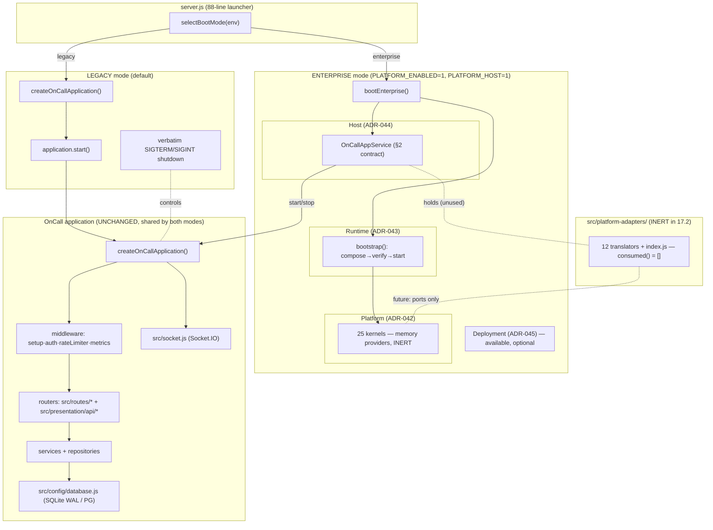
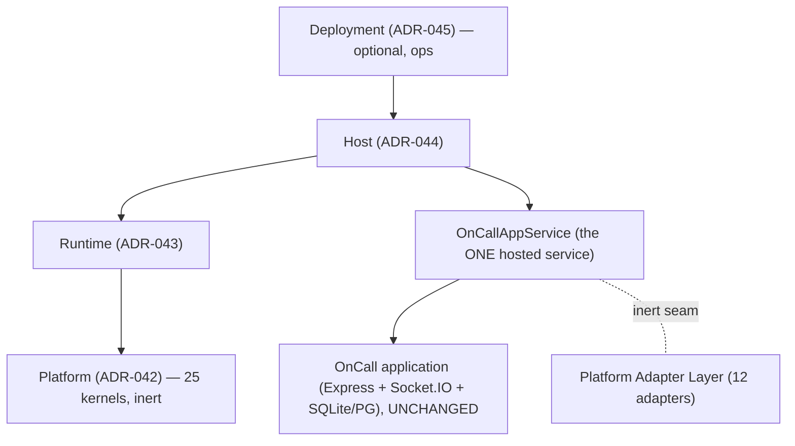
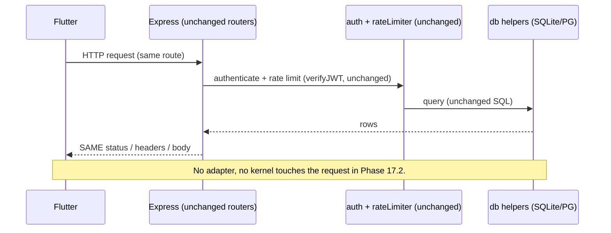
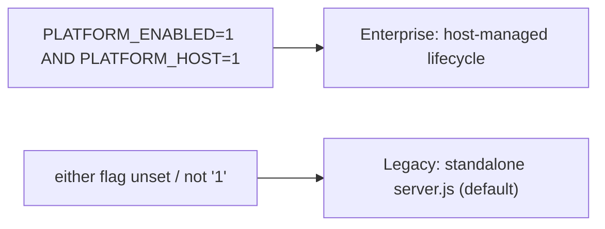

# Phase 17.2 — Updated Architecture Diagram

End-state of Phase 17.2: the unchanged OnCall backend runs as a single Hosted Service under
the Enterprise Host/Runtime. The Platform Adapter Layer exists as the sole application↔kernel
seam but is **inert** (no kernel consumed).

---

## 1. Component & control-flow view

Solid arrows are live control/data flow. The dotted `OnCallAppService ⇢ adapters ⇢ kernels`
path is present but carries nothing in 17.2 — every adapter is inert.

## 2. Layer stack (Enterprise mode)

## 3. Request path (unchanged — proves zero client impact)

## 4. Mode switch (rollback = flag)

## 5. What changed vs Phase 17.1 diagram
- 17.1 was a **plan** (adapters described as future "shadows"). 17.2 **implements** the Host
  wrapping and the adapter layer, but keeps every adapter **inert** — no shadow traffic, no
  kernel consumption. The dashed kernel links from the 17.1 target are intentionally **not**
  active yet; they arrive one at a time in later phases via injected ports.
