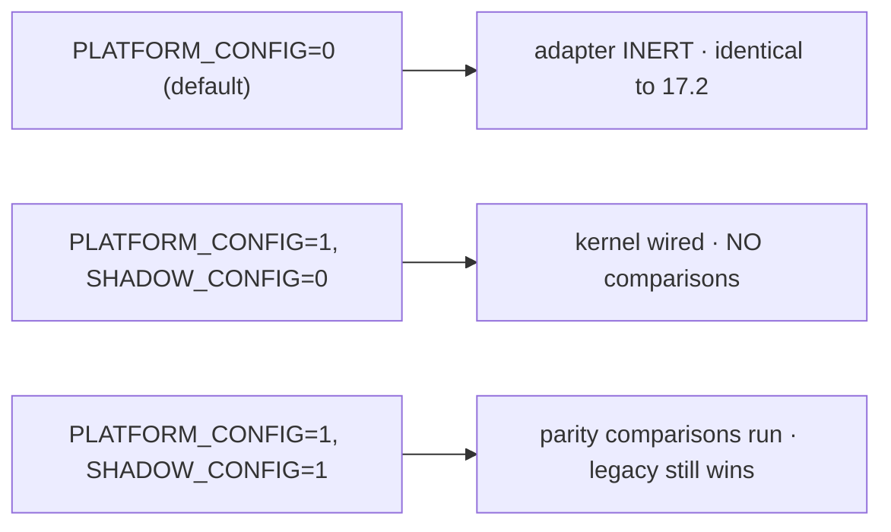

# Phase 17.3 — Updated Integration Diagram

End-state: the OnCall backend runs unchanged as the Hosted Service (17.2). The Configuration
Adapter is now connected to the Configuration Kernel in **shadow mode** — a read-only side
channel that compares values and always returns the legacy value. No other kernel is consumed.

---

## 1. Shadow data flow

```mermaid
flowchart TB
    subgraph APP["OnCall application (UNCHANGED)"]
        ENVJS["env.js — Source of Truth"]
        RTS["routers · middleware · socket · services · repos"]
    end

    subgraph SHADOW["Configuration Shadow (out-of-band, read-only)"]
        LEG["legacySource (reads env.js exports)"]
        SG["shadowGet(key) / verifyAll()"]
        MET["shadow metrics"]
    end

    subgraph ADAPT["Platform Adapter Layer"]
        CA["Configuration Adapter (consumed)"]
        OTH["11 other adapters — INERT"]
    end

    subgraph PLAT["Enterprise Platform"]
        CK["Config Kernel (ADR-019) — seeded from legacy"]
        OK["other kernels — composed, NOT consumed"]
    end

    ENVJS -->|authoritative reads| RTS
    ENVJS -.->|seed (deep-cloned) at boot| CK
    LEG -->|legacy value| SG
    SG -->|"read (only)"| CA -->|port| CK
    SG --> MET
    SG ==>|returns LEGACY value| LEG
    CK -. "value used only in compare, never exposed" .- SG

    classDef inert fill:#eee,stroke:#bbb,color:#666;
    class OTH,OK inert;
```

The application (top) reads config only from `env.js` — the shadow is a **separate** path that
never feeds the app. The kernel is seeded from legacy at boot and read back for comparison
only.

## 2. Request path (unchanged — proves zero client impact)

```mermaid
sequenceDiagram
    participant FL as Flutter
    participant EX as Express (unchanged)
    participant CFG as env.js (unchanged)
    participant SH as Config shadow (out-of-band)

    FL->>EX: HTTP request
    EX->>CFG: read config (legacy, unchanged)
    CFG-->>EX: value
    EX-->>FL: SAME response
    Note over SH: verifyAll() ran once at boot; shadowGet is NOT on the request path
```

## 3. Flag-gated states



## 4. What changed vs the Phase 17.2 diagram
- One dashed link went live: **Configuration Adapter → Config Kernel**, but strictly
  read-only/shadow (returns legacy). All other adapters remain inert; all other kernels remain
  composed-but-not-consumed. The app request path is byte-for-byte the 17.2 path.
