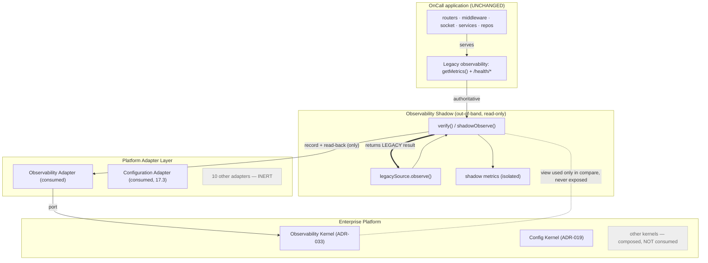
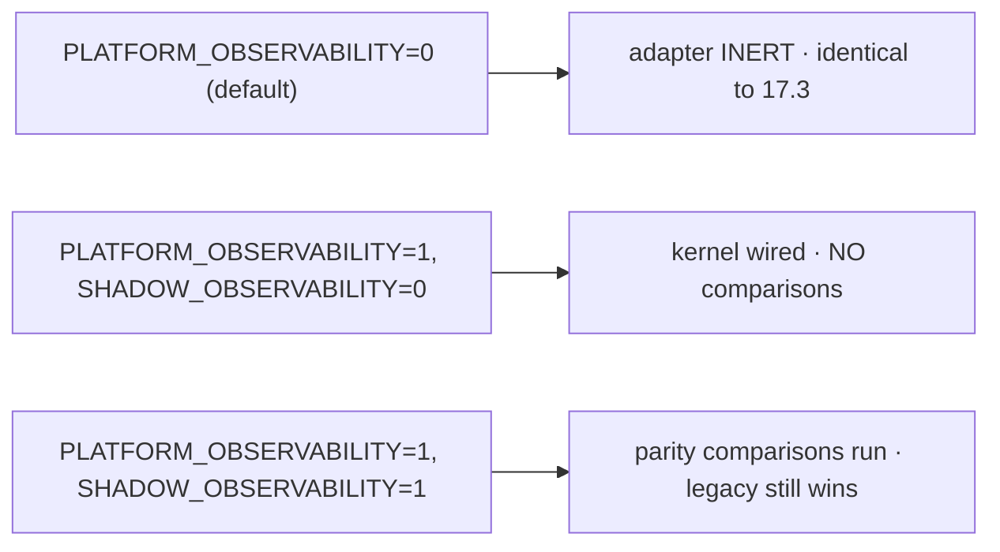
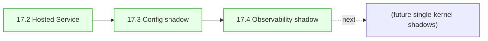

# Phase 17.4 — Updated Integration Diagram

End-state: the OnCall backend runs unchanged as the Hosted Service (17.2). **Two** adapters are
now connected in shadow mode — Configuration (17.3) and Observability (17.4) — each a read-only
side channel that compares values and always returns the legacy result. All other kernels
remain composed-but-not-consumed.

---

## 1. Shadow data flow (observability)



## 2. Request / observability path (unchanged — proves zero client impact)

```mermaid
sequenceDiagram
    participant K8s as Probe / Prometheus
    participant EX as Express (unchanged)
    participant OBS as legacy /metrics + /health/* (unchanged)
    participant SH as Observability shadow (out-of-band)

    K8s->>EX: GET /metrics or /health/*
    EX->>OBS: legacy handler (unchanged)
    OBS-->>K8s: SAME body / status / headers
    Note over SH: verify() ran once at boot; not on the request path
```

## 3. Flag-gated states



## 4. Progress across Phase 17.x



Two dashed links from the 17.1 target are now live — **Configuration → Config Kernel** and
**Observability → Observability Kernel** — both strictly read-only/shadow. Every other adapter
is inert and every other kernel is composed-but-not-consumed. The app request path and all
observability surfaces are byte-for-byte the 17.3 path.
