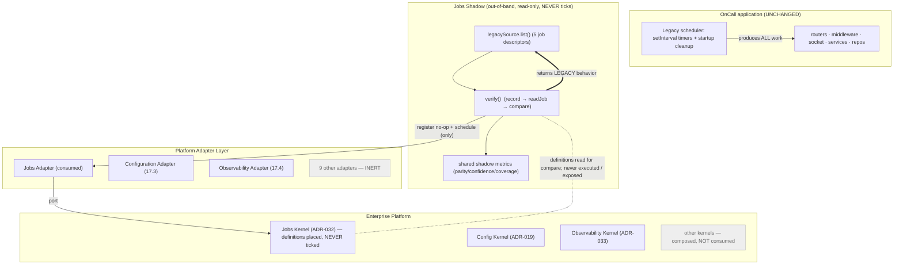
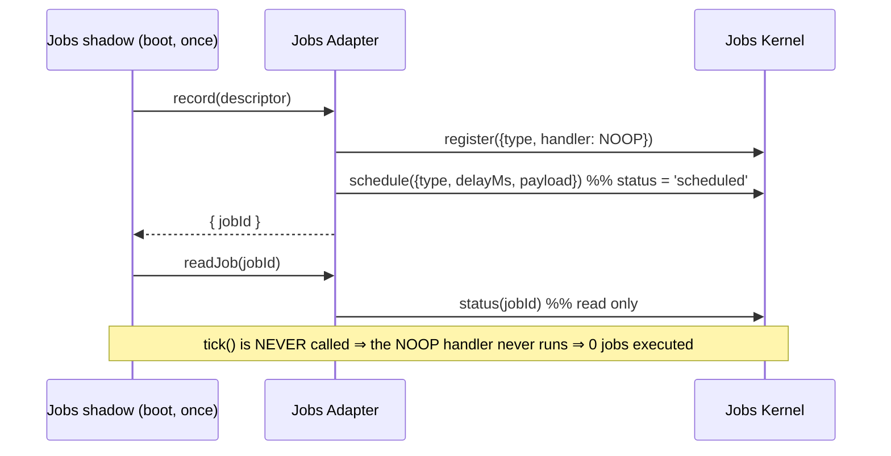
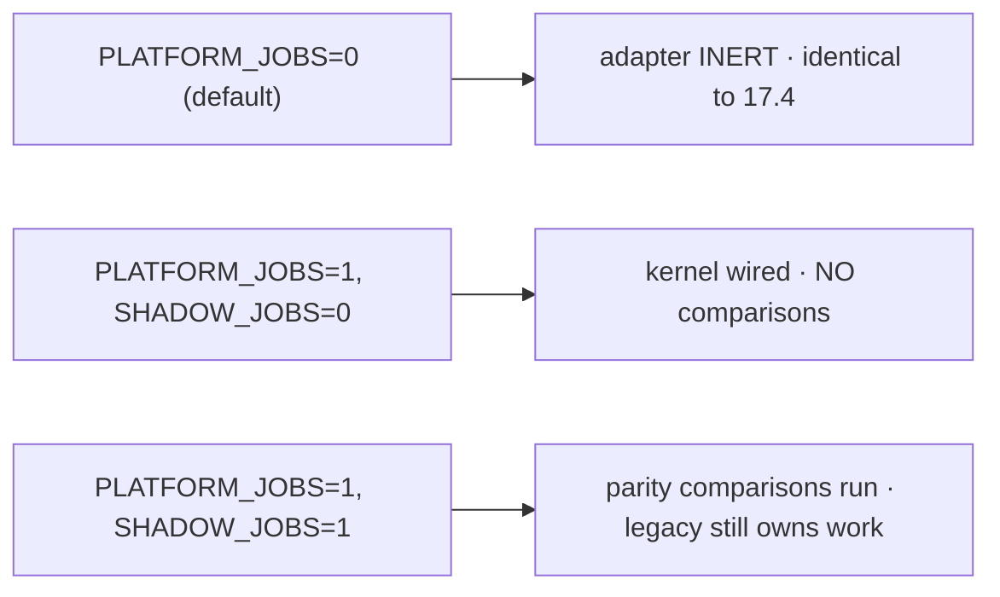
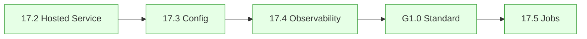

# Phase 17.5 — Updated Integration Diagram

End-state: the OnCall backend runs unchanged as the Hosted Service (17.2). **Three** adapters
are now connected in shadow mode — Configuration (17.3), Observability (17.4), Jobs (17.5) —
each read-only, non-authoritative, returning legacy results. Jobs additionally **never
executes**. All other kernels remain composed-but-not-consumed.

---

## 1. Shadow data flow (jobs)

## 2. Non-execution (the defining safety property)

## 3. Flag-gated states

## 4. Progress across Phase 17.x

Three dashed links from the 17.1 target are now live (Config, Observability, Jobs), all
read-only shadows. Jobs is the first integration authored under **G1.0** and introduces the
shared shadow framework future kernels reuse. Every other adapter stays inert; every other
kernel is composed-but-not-consumed; the app request path and legacy scheduler are unchanged.
