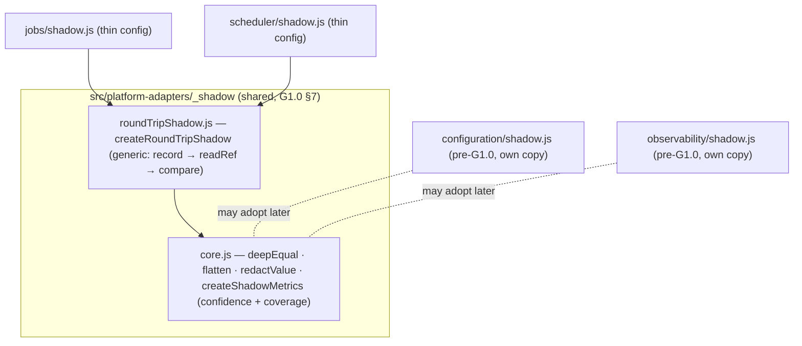
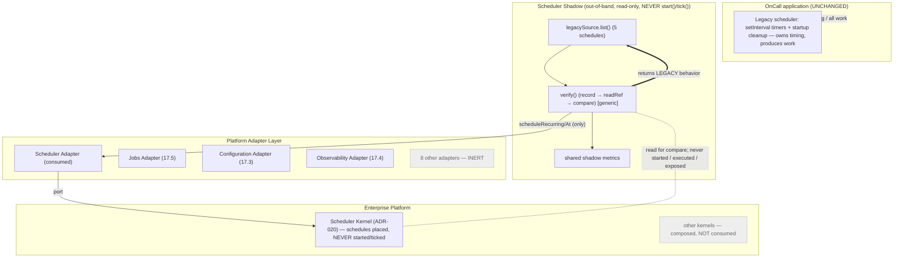
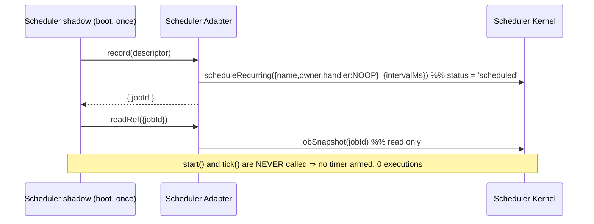
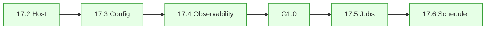

# Phase 17.6 — Updated Integration Diagram

End-state: the OnCall backend runs unchanged as the Hosted Service (17.2). **Four** adapters are
now connected in shadow mode — Configuration (17.3), Observability (17.4), Jobs (17.5),
Scheduler (17.6) — each read-only, non-authoritative, returning legacy results. Jobs and
Scheduler additionally **never execute / never own a timer**. All other kernels remain
composed-but-not-consumed.

---

## 1. Shared framework (post-generalization)

Jobs and Scheduler share ONE verify algorithm; the legacy timer inventory has ONE source.

## 2. Scheduler shadow data flow

## 3. Non-ownership / non-execution

## 4. Progress across Phase 17.x

Four dashed links from the 17.1 target are now live (Config, Observability, Jobs, Scheduler),
all read-only shadows. Scheduler is the second integration under G1.0 and the first to **reuse
and extend** the shared framework (generic verifier + shared timer inventory). Every other
adapter stays inert; every other kernel is composed-but-not-consumed; the app request path and
legacy scheduler are unchanged.
